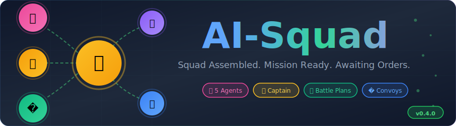
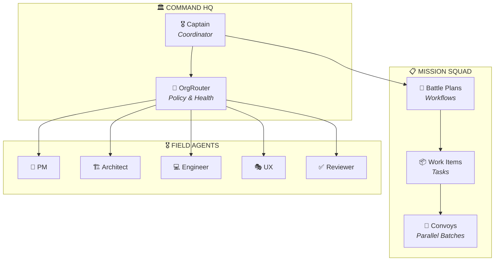
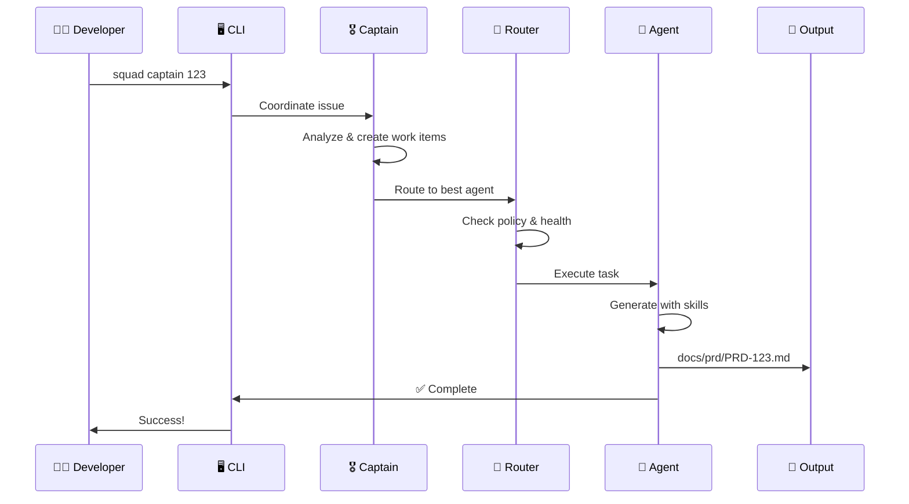
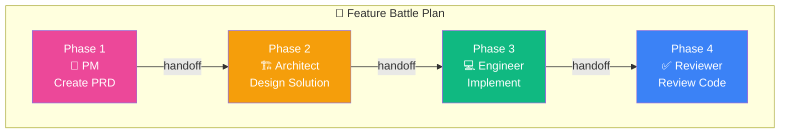
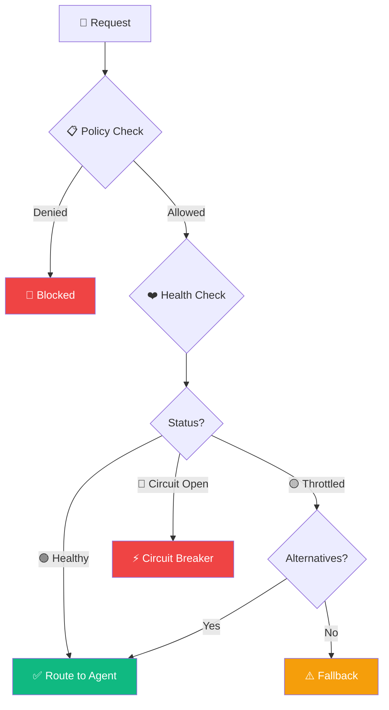
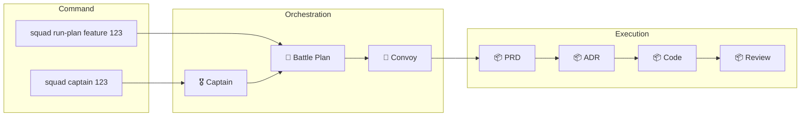
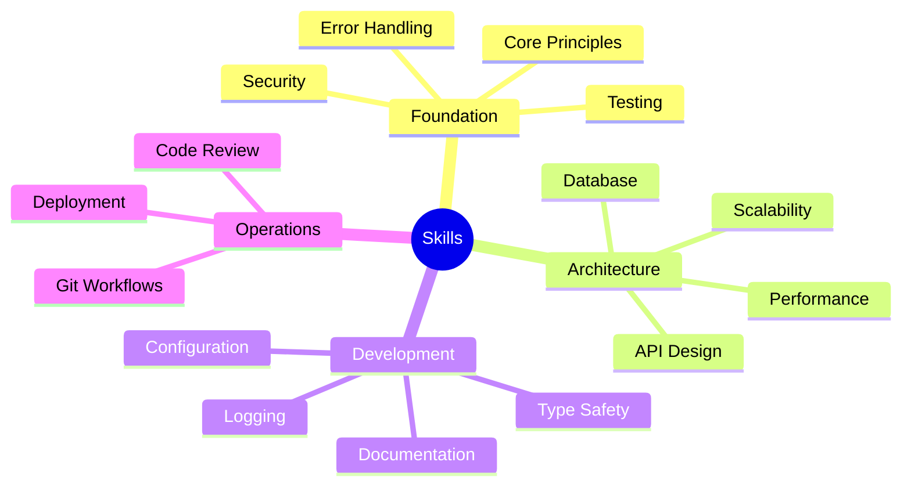
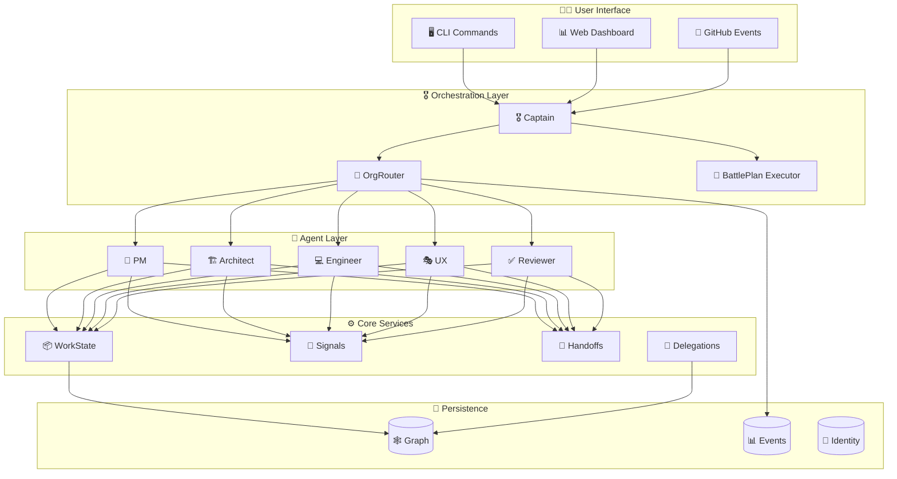

# AI-Squad

<p align="center">
  
</p>

<p align="center">
  <a href="https://badge.fury.io/py/ai-squad"></a>
  <a href="https://www.python.org/downloads/"></a>
  <a href="https://opensource.org/licenses/MIT"></a>
  <a href="tests/"></a>
  <a href="https://pypi.org/project/ai-squad/"></a>
</p>

<p align="center">
  <strong>🎖️ Five expert AI agents orchestrated by a Captain</strong><br/>
  <em>Squad Assembled • Mission Ready • Awaiting Orders</em>
</p>

---

## 🎯 What is AI-Squad?

AI-Squad is a **command-line tool** (Beta) that brings five specialized AI agents to your project:

| Agent | Role | What They Do |
|-------|------|--------------|
| 🎨 **Product Manager** | Requirements | Creates PRDs, breaks down epics into stories |
| 🏗️ **Architect** | Design | Designs solutions, writes ADRs and technical specs |
| 💻 **Engineer** | Implementation | Implements features with comprehensive tests |
| 🎭 **UX Designer** | User Experience | Creates wireframes, HTML prototypes, accessibility guidelines |
| ✅ **Reviewer** | Quality | Reviews code, security analysis, ensures quality |

**New in v0.4.0**: Advanced orchestration (Captain, Battle Plans, Convoys), web dashboard, retry logic, rate limiting, persistent storage!

**Install once. Use everywhere. No hosting required.**

---

## 🎖️ Squad Terminology

AI-Squad uses military-inspired terminology to describe its orchestration system:



| Term | What It Means | Example |
|------|---------------|---------|
| **🎖️ Captain** | Coordinator that orchestrates agents | `squad captain 123` - analyzes issue and delegates |
| **📜 Battle Plan** | Predefined workflow template | `feature` plan: PM → Architect → Engineer → Reviewer |
| **📦 Work Item** | Single unit of work tracked in system | Issue #123 becomes work item `sq-abc12` |
| **🚛 Convoy** | Parallel batch of related work items | 5 stories from an epic processed together |
| **🤝 Handoff** | Transfer of work between agents | PM completes PRD, hands off to Architect |
| **📨 Signal** | Message sent between agents | "PRD ready for review" notification |
| **🔗 Delegation** | Explicit assignment with audit trail | PM delegates API design to Architect |
| **🕸️ Graph** | Tracks relationships between entities | Shows which agent owns which work item |
| **🪪 Identity** | Provenance metadata embedded in outputs | Tracks who created what, when, and why |
| **📡 Scout** | Background worker for discovery tasks | Scans workspace for patterns |

---

## 🔄 How It Works

### The Flow



### Battle Plan Execution

When you run a **Battle Plan**, the system orchestrates multiple agents automatically:



### Routing & Health

The **OrgRouter** ensures reliable execution with policy enforcement and health monitoring:



---

## ⚡ Quick Start

### 1. Install AI-Squad

```bash
pip install ai-squad
```

### 2. Initialize in Your Project

```bash
cd /path/to/your-project
squad init
```

This creates:
- ✅ `.github/workflows/` - Automated agent execution
- ✅ `.github/agents/` - Agent definitions
- ✅ `.github/skills/` - 18 production skills
- ✅ `.github/templates/` - Document templates
- ✅ `squad.yaml` - Configuration
- ✅ `docs/` - Output directories
- ✅ `.squad/` - Internal state (graph, events, identity)

### 3. Use Your Squad!

```bash
# Single agent commands
squad pm 123           # Product Manager creates PRD
squad architect 123    # Architect designs solution
squad engineer 123     # Engineer implements feature
squad ux 123           # UX Designer creates wireframes
squad review 456       # Reviewer checks PR

# Orchestration commands
squad captain 123      # 🎖️ Captain coordinates everything
squad collab 100 pm architect  # Multi-agent collaboration
squad watch            # Auto-trigger on GitHub labels

# Monitoring commands
squad health           # View routing health
squad work             # List work items
squad dashboard        # Launch web UI
```

#### 💬 GitHub Copilot Chat Integration
Your agents work naturally in Copilot Chat - just mention them by name:

```
"PM, create requirements for user authentication"
"Architect, design a REST API for users"
"Engineer, implement JWT auth with tests"
```

See `.github/copilot-instructions.md` and `.github/agents/` for agent definitions.

---

## 🚀 Features

### 🎖️ Orchestration System



| Feature | Description |
|---------|-------------|
| **🎖️ Captain** | Intelligent coordinator that analyzes issues and delegates to agents |
| **📜 Battle Plans** | Pre-defined workflows (feature, bugfix, epic) with phase dependencies |
| **🚛 Convoys** | Parallel processing of related work items |
| **🤝 Handoffs** | Automatic work transfer between agents with context |
| **📨 Signals** | Inter-agent messaging system |
| **🔗 Delegations** | Explicit assignments with full audit trails |

### 🤖 Five Expert Agents

| Agent | Command | Output |
|-------|---------|--------|
| **🎨 Product Manager** | `squad pm <issue>` | PRD + User Stories + Backlog |
| **🏗️ Architect** | `squad architect <issue>` | ADR + Technical Spec + Diagrams |
| **💻 Engineer** | `squad engineer <issue>` | Code + Tests + Documentation |
| **🎭 UX Designer** | `squad ux <issue>` | Wireframes + User Flows + Prototype |
| **✅ Reviewer** | `squad review <pr>` | Code Review + Security Analysis |

### 📊 Web Dashboard

Launch the monitoring dashboard to visualize your Squad's operations:

```bash
squad dashboard
# Opens http://127.0.0.1:5050
```

**Dashboard Pages:**
- **Overview** - Stats, health status, recent activity
- **Health** - Routing health with circuit breakers
- **Work Items** - Track all work across agents
- **Delegations** - View delegation links and audit trails
- **Convoys** - Monitor parallel work batches
- **Graph** - Interactive operational graph visualization

### 🧠 Multi-Agent Collaboration

```bash
# PM and Architect collaborate on Epic planning
squad collab 100 pm architect

# Flow:
# 1. PM drafts PRD
# 2. Architect reviews for feasibility
# 3. They iterate together
# 4. Both finalize documents
```

### 📚 18 Production Skills

Every agent follows battle-tested production standards:



[See all skills →](docs/skills.md)

### 🎨 Template-Driven Documents

All outputs use standardized templates:
- **PRD** - Product Requirements Document
- **ADR** - Architecture Decision Record
- **Spec** - Technical Specification
- **UX** - UX Design Document
- **Review** - Code Review Report

### 🔄 GitHub Actions Integration

**Automatic agent execution when issues are labeled:**

```yaml
# .github/workflows/squad-orchestrator.yml (auto-generated)
on:
  issues:
    types: [labeled]

# Label 'type:feature' → PM creates PRD
# Label 'type:story' → Engineer implements
# Label 'needs:design' → UX Designer creates wireframes
```

---

## 💡 Usage Examples

### Example 1: Feature Development

```bash
# You have issue #123: "Add OAuth Login"

# Step 1: PM creates requirements
squad pm 123
# ✅ Output: docs/prd/PRD-123.md

# Step 2: Architect designs solution
squad architect 123
# ✅ Output: docs/adr/ADR-123.md + docs/specs/SPEC-123.md

# Step 3: UX designs interface
squad ux 123
# ✅ Output: docs/ux/UX-123.md

# Step 4: Engineer implements
squad engineer 123
# ✅ Output: src/auth/*.py + tests/auth/*.py + PR created

# Step 5: Reviewer checks quality
squad review 456
# ✅ Output: docs/reviews/REVIEW-456.md + PR comments
```

### Example 2: Epic Planning

```bash
# Issue #100: "User Authentication System" (Epic)

# Multi-agent collaboration
squad collab 100 pm architect

# What happens:
# - PM drafts initial PRD
# - Architect reviews for technical feasibility
# - PM addresses concerns
# - Architect creates ADR
# - Both approve final plan
# - Output: PRD-100.md + ADR-100.md
```

### Example 3: Bug Fixing

```bash
# Issue #789: "Login returns 500 error"

# Engineer investigates and fixes
squad engineer 789

# What happens:
# - Analyzes codebase
# - Identifies root cause
# - Implements fix
# - Adds regression test
# - Creates PR with fix
```

---

## 📖 Command Reference

### Initialization

```bash
squad init                    # Initialize AI-Squad in project
squad doctor                  # Validate setup
squad update                  # Update AI-Squad
```

### Agent Commands

```bash
squad pm <issue>              # 🎨 Product Manager: Create PRD
squad architect <issue>       # 🏗️ Architect: Create ADR/Spec
squad engineer <issue>        # 💻 Engineer: Implement feature
squad ux <issue>              # 🎭 UX Designer: Create design
squad review <pr>             # ✅ Reviewer: Review PR
```

### Orchestration Commands

```bash
squad captain <issue>         # 🎖️ Captain coordinates work
squad collab <issue> <agents> # Multi-agent collaboration
squad watch                   # Auto-trigger on labels
squad run-plan <plan> <issue> # Execute a battle plan
```

### Monitoring Commands

```bash
squad health                  # View routing health status
squad work                    # List all work items
squad convoys                 # List active convoys
squad dashboard               # Launch web dashboard
squad graph export            # Export operational graph
squad graph impact <node>     # Analyze impact of changes
```

**Examples:**
```bash
squad captain 123                   # Let Captain handle everything
squad collab 123 pm architect       # Epic planning
squad collab 456 architect engineer # Technical design + implementation
squad run-plan feature 123          # Execute feature workflow
squad health                        # Check system health
squad dashboard --port 8080         # Custom dashboard port
```

---

## ⚙️ Configuration

AI-Squad uses `squad.yaml` (created by `squad init`):

```yaml
# squad.yaml
version: "1.0"

project:
  name: "YourProject"
  repository: "owner/repo"

agents:
  product_manager:
    enabled: true
    model: "gpt-5.1"
    temperature: 0.3
    
  architect:
    enabled: true
    model: "claude-opus-4-5"
    temperature: 0.2
    
  engineer:
    enabled: true
    model: "gpt-5.1-codex-max"
    temperature: 0.1

# 📡 Routing Policy (NEW)
routing:
  enforce_cli_routing: false
  warn_block_rate: 0.25
  critical_block_rate: 0.5
  circuit_breaker_block_rate: 0.7
  trust_level: high
  data_sensitivity: internal

output:
  prd: "docs/prd"
  adr: "docs/adr"
  specs: "docs/specs"
  ux: "docs/ux"
  reviews: "docs/reviews"

github:
  auto_commit: true
  create_pr: false
  add_labels: true
```

**Customize models, routing policies, enable/disable agents, change output paths.**

---

## 🏗️ Architecture

### System Overview



### Storage Structure

```
.squad/
├── capabilities/        # Installed capability packages
├── delegations/         # Delegation links with audit trails
├── events/              # Routing events (JSONL)
├── graph/               # Operational graph (nodes + edges)
├── handoffs/            # Handoff records
├── identity/            # Current identity dossier
├── scout_workers/       # Scout run checkpoints
├── signals/             # Inter-agent messages
└── work_items/          # Work item state
```

### CLI Tool + GitHub Actions

```
┌─────────────────────────────────────────────────────────┐
│ Developer                                                │
│   ↓                                                      │
│ squad captain 123                                        │
│   ↓                                                      │
│ AI-Squad CLI (Python)                                   │
│   ├─ Loads squad.yaml                                   │
│   ├─ Fetches issue from GitHub                          │
│   ├─ Captain analyzes & creates work items              │
│   └─ Routes to appropriate agents                       │
│   ↓                                                      │
│ Agent Execution                                         │
│   ├─ Production skills loaded                           │
│   ├─ Tools (GitHub, templates)                          │
│   ├─ Identity dossier attached                          │
│   └─ Output generated                                   │
│   ↓                                                      │
│ Output: docs/prd/PRD-123.md (with provenance)           │
│   ↓                                                      │
│ Git commit + push (if auto_commit: true)                │
└─────────────────────────────────────────────────────────┘
```

**Key Points:**
- Runs locally OR in GitHub Actions
- No hosted service needed
- Full audit trail with Identity dossiers
- Health-aware routing with circuit breakers

---

## 💰 Cost

### AI-Squad: FREE

- ✅ CLI Tool: **$0** (MIT License)
- ✅ Installation: **$0**
- ✅ All Features: **$0**
- ✅ Updates: **$0**

### Usage Costs

| Service | Cost | Notes |
|---------|------|-------|
| GitHub Copilot | $10-39/mo per user | Already paying if using Copilot |
| GitHub Actions | Free tier: 2,000 min/mo | ~400 agent runs/mo |
| **AI-Squad** | **$0** | **Completely free** |

**No Hidden Costs:**
- ❌ No hosting fees
- ❌ No database costs
- ❌ No infrastructure
- ❌ No per-seat licensing

**ROI Example:**  
Team of 10 developers, 100 agent runs/week:
- Time saved: ~200 hours/month
- Value: ~$30,000/month
- **AI-Squad cost: $0**

---

## 🚀 Why AI-Squad?

### vs Manual Work

| Task | Manual | AI-Squad | Savings |
|------|--------|----------|---------|
| **PRD Creation** | 4-8 hours | 2 minutes | 96%+ faster |
| **Architecture Design** | 6-12 hours | 3 minutes | 97%+ faster |
| **Feature Implementation** | 2-5 days | 10-30 minutes | 90%+ faster |
| **Code Review** | 1-2 hours | 2 minutes | 98%+ faster |

### vs Other Tools

| Feature | AI-Squad | Other AI Tools |
|---------|----------|----------------|
| **Multi-agent system** | ✅ 5 specialized agents | ❌ Single generic AI |
| **Production skills** | ✅ 18 battle-tested skills | ❌ Generic advice |
| **GitHub integration** | ✅ Native issue/PR workflow | ⚠️ Manual copying |
| **Template-driven** | ✅ Standardized outputs | ❌ Inconsistent |
| **Cost** | ✅ $0 (uses your Copilot) | ⚠️ $20-100+/mo |
| **Hosting** | ✅ None needed | ⚠️ Cloud service |

---

## 📚 Documentation

- **[Quick Start Guide](docs/quickstart.md)** - Get started in 5 minutes
- **[CLI Commands Guide](docs/CLI-GUIDE.md)** - All commands with examples
- **[Configuration](docs/configuration.md)** - Customize `squad.yaml`
- **[Agents Guide](AGENTS.md)** - How each agent works
- **[Architecture Diagrams](docs/architecture/ARCHITECTURE-DIAGRAMS.md)** - Visual system design
- **[Skills Reference](docs/skills.md)** - 18 production skills
- **[GitHub Actions](docs/github-actions.md)** - Automation setup
- **[Examples](examples/)** - Real-world usage examples
- **[Contributing](CONTRIBUTING.md)** - Help improve AI-Squad

---

## 🧪 Examples

Check out the [`examples/`](examples/) directory:

- **[basic-usage/](examples/basic-usage/)** - Simple single-agent usage
- **[multi-agent-collab/](examples/multi-agent-collab/)** - PM + Architect collaboration
- **[github-actions/](examples/github-actions/)** - Full CI/CD integration
- **[custom-config/](examples/custom-config/)** - Advanced configuration

---

## 🤝 Contributing

We love contributions! See [CONTRIBUTING.md](CONTRIBUTING.md) for:

- How to set up development environment
- Code style guidelines
- How to add new agents
- How to add new skills
- Testing requirements

---

## 📜 License

MIT License - see [LICENSE](LICENSE) for details.

---

## 🙏 Acknowledgments

Built on:
- [GitHub Copilot SDK](https://github.com/github/copilot-sdk) - AI agent framework
- [Click](https://click.palletsprojects.com/) - CLI framework
- [Rich](https://rich.readthedocs.io/) - Terminal formatting

Inspired by:
- [AgentX](https://github.com/jnPiyush/AgentX) - Original multi-agent workflow framework
- GitHub Copilot - Revolutionizing developer productivity

---

## 🔗 Links

- **GitHub:** https://github.com/jnPiyush/AI-Squad
- **PyPI:** https://pypi.org/project/ai-squad/
- **Documentation:** https://github.com/jnPiyush/AI-Squad/tree/main/docs
- **Issues:** https://github.com/jnPiyush/AI-Squad/issues
- **Discussions:** https://github.com/jnPiyush/AI-Squad/discussions

---

## ⭐ Star Us!

If AI-Squad saves you time, give us a star on GitHub! ⭐

It helps others discover the tool and motivates us to keep improving it.

---

**AI-Squad** - Your AI Development Squad, One Command Away 🚀


