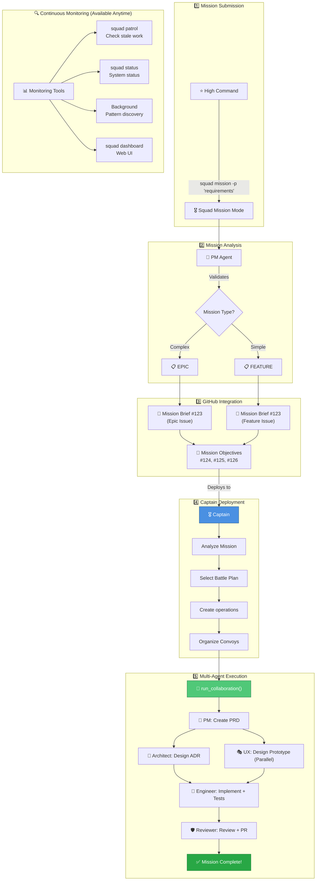
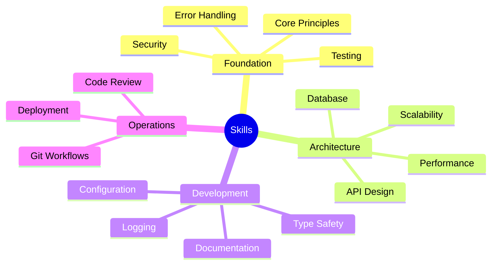
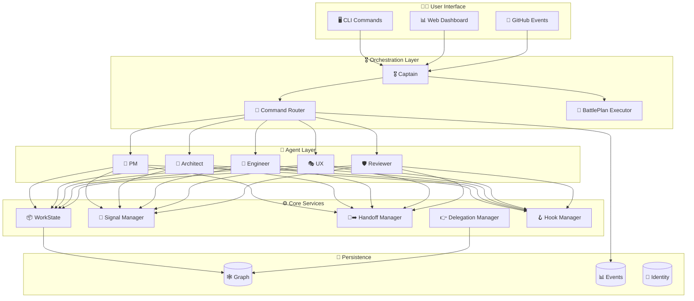

# AI-Squad

<p align="center">
  
</p>

<p align="center">
  <a href="https://badge.fury.io/py/ai-squad"></a>
  <a href="https://www.python.org/downloads/"></a>
  <a href="https://opensource.org/licenses/MIT"></a>
  <a href="tests/"></a>
  <a href="https://pypi.org/project/ai-squad/"></a>
</p>

<p align="center">
  <strong>🎖️ Five expert AI agents orchestrated by a Captain</strong><br/>
  <em>Squad Assembled • Mission Ready • Awaiting Orders</em>
</p>

---

## ⚔️ AI-Squad: Military-Orchestrated AI Agents

AI-Squad is a **CLI tool** that brings **five specialized AI agents** orchestrated by a **Captain** using military-inspired workflows. Install once, use everywhere. No hosting required.

**Latest:** v0.6.0 with enhanced monitoring and operational tracking.

### Squad Components


| Component | Role | Description |
|-----------|------|-------------|
| **🎖️ Captain** | Meta-Coordinator | Analyzes issues, selects battle plans, orchestrates agents |
| **📜 Battle Plan** | Workflow Template | Pre-defined sequences: `feature`, `bugfix`, `epic` |
| **🎨 Product Manager** | Agent | Creates PRDs, breaks down epics, defines requirements |
| **🧩 Architect** | Agent | Designs solutions, writes ADRs and technical specs |
| **🔧 Engineer** | Agent | Implements features with tests (≥80% coverage) |
| **🎭 UX Designer** | Agent | Wireframes, HTML prototypes, WCAG 2.1 AA compliance |
| **🛡️ Reviewer** | Agent | Code review, security analysis, quality assurance |
| **🚐 Convoy** | Parallel Executor | Processes multiple operations simultaneously |
| **👋➡️ Handoff** | Work Transfer | Automatic context transfer between agents |
| **📡 Signal** | Messaging | Inter-agent communication system |
| **🧭 Router** | Health Monitor | Policy enforcement and circuit breaker logic |
| **🔍 Patrol** | Monitoring | Detects stale/stuck work (`squad patrol`) |
| **🔍 Recon** | Intelligence | Status reports and reconnaissance (`squad status`) |
| **🔍 Scout** | Discovery | Background pattern detection and workspace scanning |

---

## ⚡ Quick Start

### Prerequisites

**Core Requirements:**
- Python 3.11+
- Git
- GitHub CLI (`gh`)
- GitHub Account
- GitHub Copilot subscription (required for AI features)

**Install GitHub CLI:**
- Windows: `winget install GitHub.cli`
- macOS: `brew install gh`  
- Linux: `sudo apt install gh` (Debian/Ubuntu) or [see installation guide](https://github.com/cli/cli#installation)

**Optional (for dashboard):**
- Flask: `pip install ai-squad[dashboard]`

### Installation & Setup

```bash
# 1. Verify Python version (3.11+ required)
python --version

# 2. Install AI-Squad
pip install ai-squad

# 3. (Optional) Install dashboard support
pip install ai-squad[dashboard]

# 4. Initialize project
cd /path/to/your-project
squad deploy

# 5. Authenticate with GitHub (if not already)
gh auth login

# 6. Install GitHub Copilot CLI extension (auto-prompted during install)
gh extension install github/gh-copilot
```

**What `squad deploy` creates:**
- `.github/agents/` (5 agent definitions), `.github/skills/` (18 production skills), `.github/templates/`
- `squad.yaml` (configuration), `docs/` folders, `.squad/` (internal state)

### Post-Installation Verification

**Run these commands to verify your setup:**

```bash
# 1. Check installation
squad --version
squad sitrep

# 2. Expected output from 'squad sitrep':
#    ✓ Python 3.11+
#    ✓ GitHub CLI installed
#    ✓ GitHub Copilot CLI extension installed
#    ✓ GitHub authentication valid
#    ✓ GitHub Copilot SDK available

# 3. Test a simple agent
squad pm <issue-number>  # Replace with actual GitHub issue
```

**If any checks fail, see the [Troubleshooting](#-troubleshooting) section below.**

### Usage

**🎖️ Squad Mission Mode** (Full autonomous workflow):

> 💡 [Complete guide →](docs/AUTONOMOUS.md)

```bash
squad mission -p "Create a REST API for user management"
# Creates GitHub issues, deploys to Captain, orchestrates all agents

squad mission -f brief.txt    # From file
squad mission -i               # Interactive mode
squad mission -p "..." --plan-only  # Create brief only, manual deployment
```

**Individual Commands:**
```bash
squad pm 123              # Product Manager: Create PRD
squad architect 123       # Architect: Design solution (ADR + spec)
squad engineer 123        # Engineer: Implement with tests
squad ux 123              # UX Designer: Wireframes + prototype
squad review 456          # Reviewer: Code review + security

squad captain 123         # Captain coordinates everything
squad joint-op 100 pm architect  # Multi-agent collaboration
squad status              # View system health
squad dashboard           # Launch web UI (http://127.0.0.1:5050)
```

**GitHub Copilot Chat Integration:**
```
"PM, create requirements for user authentication"
"Architect, design a REST API"
"Engineer, implement JWT auth with tests"
```

---

## 🎖️ Complete Squad Mission Workflow

Here's how Squad Mission Mode orchestrates your entire development lifecycle:



**Monitoring Tools** (available anytime): `squad patrol` | `squad status` | `squad dashboard`

---

## �️ 18 Production Skills

Every agent follows battle-tested production standards:



**All agents have access to:**
- **Foundation Skills**: Testing strategies, Security practices, Error handling, Core principles (SOLID, DRY, KISS)
- **Architecture Skills**: Performance optimization, Scalability patterns, Database design, API design
- **Development Skills**: Configuration management, Documentation standards, Type safety, Logging & monitoring
- **Operations Skills**: Git workflows, Code review & audit, Deployment strategies

📚 [See detailed skills documentation →](docs/skills.md)

---

## 📖 Command Reference

### Initialization

```bash
squad deploy                    # Initialize AI-Squad in project
squad sitrep                  # Validate setup
squad update                  # Update AI-Squad
```

### Agent Commands

```bash
squad pm <issue>              # 🎨 Product Manager: Create PRD
squad architect <issue>       # 🧩 Architect: Create ADR/Spec
squad engineer <issue>        # 🔧 Engineer: Implement feature
squad ux <issue>              # 🎭 UX Designer: Create design
squad review <pr>             # 🛡️ Reviewer: Review PR
```

### Orchestration Commands

```bash
squad captain <issue>         # 🎖️ Captain coordinates work
squad joint-op <issue> <agents> # Multi-agent collaboration
squad patrol                   # Auto-trigger on labels
```

### Monitoring Commands

```bash
squad status                  # View routing health status
squad ops                    # List all operations
squad convoys                 # List active convoys
squad dashboard               # Launch web dashboard
squad graph export            # Export operational graph
squad graph impact <node>     # Analyze impact of changes
```

---

## ⚙️ Configuration

AI-Squad uses `squad.yaml` (created by `squad deploy`):

```yaml
# squad.yaml
version: "1.0"

project:
  name: "YourProject"
  repository: "owner/repo"

agents:
  product_manager:
    enabled: true
    model: "gpt-5.1"
    temperature: 0.3
    
  architect:
    enabled: true
    model: "claude-opus-4-5"
    temperature: 0.2
    
  engineer:
    enabled: true
    model: "gpt-5.1-codex-max"
    temperature: 0.1

# 📡 Routing Policy (NEW)
routing:
  enforce_cli_routing: false
  warn_block_rate: 0.25
  critical_block_rate: 0.5
  circuit_breaker_block_rate: 0.7
  trust_level: high
  data_sensitivity: internal

output:
  prd: "docs/prd"
  adr: "docs/adr"
  specs: "docs/specs"
  ux: "docs/ux"
  reviews: "docs/reviews"

github:
  auto_commit: true
  create_pr: false
  add_labels: true
```

**Customize models, routing policies, enable/disable agents, change output paths.**

---

## 🧩 Architecture

### System Overview



### Storage Structure

```
.squad/
├── capabilities/        # Installed capability packages
├── delegations/         # Delegation links with audit trails
├── events/              # Routing events (JSONL)
├── graph/               # Operational graph (nodes + edges)
├── handoffs/            # Handoff records
├── hooks/               # Hook snapshots (if enabled)
├── identity/            # Current identity dossier
├── recon/               # Reconnaissance summaries
├── scout_workers/       # Scout run checkpoints
├── operations/          # Operation state tracking
├── workstate.json       # Work item state
├── workers.json         # Worker lifecycle records
└── theater.json         # Theater state
```

### CLI Tool + GitHub Actions

```
┌─────────────────────────────────────────────────────────┐
│ High Command                                             │
│   ↓                                                      │
│ squad captain 123                                        │
│   ↓                                                      │
│ AI-Squad CLI (Python)                                   │
│   ├─ Loads squad.yaml                                   │
│   ├─ Fetches issue from GitHub                          │
│   ├─ Captain analyzes & creates operations              │
│   └─ Routes to appropriate agents                       │
│   ↓                                                      │
│ Agent Execution                                         │
│   ├─ Production skills loaded                           │
│   ├─ Tools (GitHub, templates)                          │
│   ├─ Identity dossier attached                          │
│   └─ Output generated                                   │
│   ↓                                                      │
│ Output: docs/prd/PRD-123.md (with provenance)           │
│   ↓                                                      │
│ Git commit + push (if auto_commit: true)                │
└─────────────────────────────────────────────────────────┘
```

**Key Points:**
- Runs locally OR in GitHub Actions
- No hosted service needed
- Full audit trail with Identity dossiers
- Health-aware routing with circuit breakers

---

## 🔧 Troubleshooting

### Import Error: No module named 'github_copilot_sdk'

**Issue:** You see an error like `ModuleNotFoundError: No module named 'github_copilot_sdk'`

**Cause:** The PyPI package is named `github-copilot-sdk`, but it provides the `copilot` module (not `github_copilot_sdk`).

**Solution:** 
1. Ensure you have the latest version of AI-Squad:
   ```bash
   pip install --upgrade ai-squad
   ```

2. Verify the GitHub Copilot SDK is installed:
   ```bash
   pip install --upgrade github-copilot-sdk>=0.1.16
   ```

3. Test the import:
   ```python
   python -c "from copilot import CopilotSDK; print('✓ SDK available')"
   ```

### Dashboard Not Starting

**Issue:** `squad dashboard` fails with "Flask is not installed"

**Solution:**
1. Install dashboard dependencies:
   ```bash
   pip install ai-squad[dashboard]
   # or
   pip install flask>=3.0.0 werkzeug>=3.0.0
   ```

2. Verify installation:
   ```bash
   python -c "import flask; print(f'✓ Flask {flask.__version__}')"
   ```

3. Start dashboard:
   ```bash
   squad dashboard
   # Access at http://127.0.0.1:5050
   ```

### Installation Verification

**After installing AI-Squad, verify your setup:**

```bash
# 1. Check AI-Squad version
squad --version

# 2. Check Python version (must be 3.11+)
python --version

# 3. Verify GitHub CLI and authentication
gh auth status

# 4. Check GitHub Copilot CLI extension
gh extension list | grep copilot

# 5. Run comprehensive health check
squad sitrep
```

**Expected output from `squad sitrep`:**
- ✓ Python version 3.11+
- ✓ GitHub CLI installed
- ✓ GitHub Copilot CLI extension installed
- ✓ GitHub authentication valid
- ✓ GitHub Copilot SDK available

### GitHub Authentication Required

**Issue:** Authentication errors or "GitHub authentication not configured"

**Solution: GitHub CLI OAuth Authentication**

AI-Squad uses **GitHub CLI OAuth** as the only authentication method.

```bash
# 1. Install GitHub CLI (if not installed)
winget install GitHub.cli  # Windows
brew install gh            # Mac
# Linux: https://github.com/cli/cli#installation

# 2. Authenticate with OAuth
gh auth login

# 3. Verify authentication
gh auth status

# 4. Verify AI-Squad setup
squad sitrep
```

**Why OAuth Only?**
- ✅ No manual token management or security risks
- ✅ Automatic token rotation by GitHub
- ✅ More secure than static tokens
- ✅ Supports SSO, MFA, and enterprise features
- ✅ Same auth method used by GitHub CLI
- ✅ Simpler setup - just one command

### Missing .github Files After Installation

**Issue:** After installing AI-Squad and running `squad deploy`, the `.github/` folder is missing files or is empty

**Solution:**
1. Ensure you have the latest version:
   ```bash
   pip install --upgrade ai-squad
   ```

2. Reinitialize the project:
   ```bash
   squad deploy --force
   ```

3. Verify files were created:
   ```bash
   # Windows PowerShell
   Get-ChildItem -Path ".github" -Recurse | Select-Object FullName
   
   # Linux/Mac
   find .github -type f
   ```

   You should see:
   - `.github/agents/` (5 files: pm.md, architect.md, engineer.md, ux.md, reviewer.md)
   - `.github/skills/` (18 directories with SKILL.md files)
   - `.github/templates/` (7 template files)
   - `.github/copilot-instructions.md`

### For More Issues

- Check [docs/commands.md](docs/commands.md) for detailed command usage
- See [CONTRIBUTING.md](CONTRIBUTING.md) for development setup
- Open an issue: https://github.com/jnPiyush/AI-Squad/issues

---

## 📚 Additional Resources

- **[Agents Guide](AGENTS.md)** - Detailed information about each agent
- **[Autonomous Mode Guide](docs/AUTONOMOUS.md)** - Squad Mission Mode workflows
- **[Configuration Guide](docs/configuration.md)** - Customize `squad.yaml`
- **[Examples](examples/)** - Real-world usage examples and patterns
- **[Contributing](CONTRIBUTING.md)** - Help improve AI-Squad

---

## 🔗 Links & Community

- **GitHub:** https://github.com/jnPiyush/AI-Squad
- **PyPI:** https://pypi.org/project/ai-squad/
- **Issues:** https://github.com/jnPiyush/AI-Squad/issues
- **Discussions:** https://github.com/jnPiyush/AI-Squad/discussions

**Built with:**
- [GitHub Copilot SDK](https://github.com/github/copilot-sdk) - AI agent framework
- [Click](https://click.palletsprojects.com/) - CLI framework
- [Rich](https://rich.readthedocs.io/) - Terminal formatting

**MIT License** - see [LICENSE](LICENSE)

---

<p align="center">
  <strong>⭐ If AI-Squad saves you time, star us on GitHub!</strong><br/>
  <em>AI-Squad - Your AI Development Squad, One Command Away 🚀</em>
</p>


