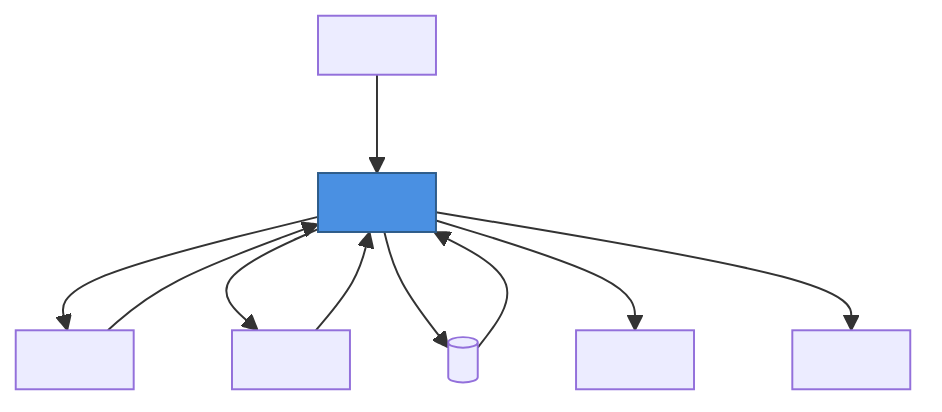
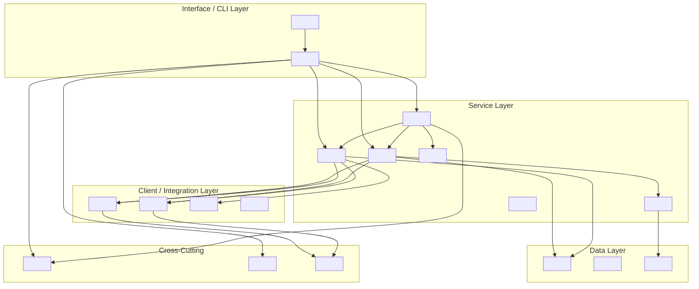
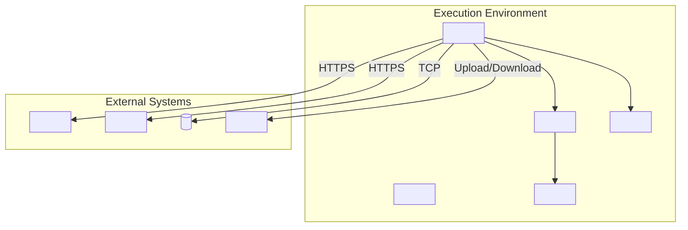
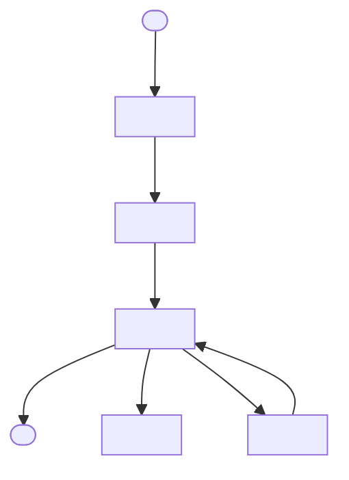
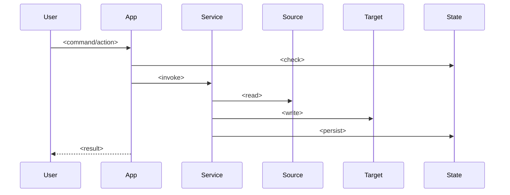
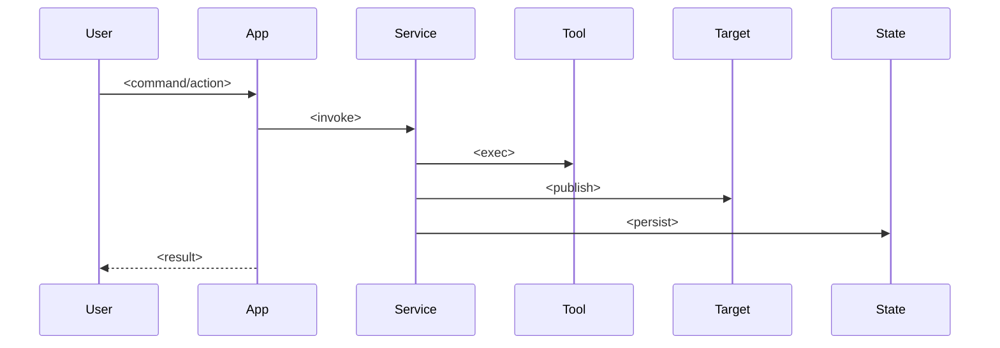

````markdown name=ARCHITECTURE.template.md
# <PROJECT NAME> — Architecture Documentation

**Version**: <x.y>  
**Last Updated**: <YYYY-MM-DD>  
**Status**: <Draft|In Review|Production>  

---

## Table of Contents

- [Executive Summary](#executive-summary)
  - [Key Capabilities](#key-capabilities)
- [System Context](#system-context)
  - [System Context Diagram](#system-context-diagram)
- [Component Architecture](#component-architecture)
  - [Component Diagram](#component-diagram)
  - [Component Responsibilities](#component-responsibilities)
  - [Service Layer Components](#service-layer-components)
- [Technology Stack](#technology-stack)
  - [Core Technologies](#core-technologies)
  - [Design Patterns](#design-patterns)
- [Non-Functional Requirements Analysis](#non-functional-requirements-analysis)
  - [Scalability](#scalability)
  - [Performance](#performance)
  - [Security](#security)
  - [Reliability](#reliability)
  - [Maintainability](#maintainability)
- [Deployment Architecture](#deployment-architecture)
  - [Deployment Diagram](#deployment-diagram)
- [Data Flow Architecture](#data-flow-architecture)
  - [Data Flow Diagram](#data-flow-diagram)
- [Sequence Diagrams](#sequence-diagrams)
  - [<Scenario 1> Sequence](#scenario-1-sequence)
  - [<Scenario 2> Sequence](#scenario-2-sequence)
- [State Management](#state-management)
  - [Database Schema (High-Level)](#database-schema-high-level)
- [Error Handling](#error-handling)
  - [Exception Hierarchy](#exception-hierarchy)
  - [Retry Strategy](#retry-strategy)
- [Testing Strategy](#testing-strategy)
  - [Test Pyramid](#test-pyramid)
  - [Coverage & Tooling](#coverage--tooling)
- [Risks and Mitigations](#risks-and-mitigations)
  - [Risk Response Plans](#risk-response-plans)
- [Roadmap / Next Steps](#roadmap--next-steps)
  - [For Development Teams](#for-development-teams)
  - [For Operations Teams](#for-operations-teams)
  - [For Migration Planners / Users](#for-migration-planners--users)
- [References](#references)
  - [Internal Documentation](#internal-documentation)
  - [External Resources](#external-resources)

---

## Executive Summary

<One-paragraph description of what the system is, who it is for, and what problem it solves.>

### Key Capabilities

- **<Capability 1>** — <short description>
- **<Capability 2>** — <short description>
- **<Capability 3>** — <short description>
- **<Capability 4>** — <short description>
- **<Capability 5>** — <short description>

---

## System Context

<Describe how the system fits into the broader ecosystem; identify users, source/target systems, and major external dependencies.>

### System Context Diagram



**Explanation**:  
- **<User>**: <what they do>
- **<Source system>**: <what it provides>
- **<Target system>**: <what it receives>
- **<State store>**: <what is stored and why>
- **<Tooling>**: <why needed>
- **<Storage>**: <what is stored and why>

**External Dependencies**:
- <Dependency 1>
- <Dependency 2>
- <Dependency 3>

---

## Component Architecture

### Component Diagram



### Component Responsibilities

**Interface / CLI Layer**:
- **<Entry Point>**: <DI setup, startup, command registration>
- **<Handlers>**: <parse args, invoke services, format output>

**Service Layer**:
- **<Orchestrator>**: <coordinates workflows>
- **<Service 1>**: <what it migrates/does>
- **<Service 2>**: <what it migrates/does>
- **<Mapper>**: <how transformations happen>
- **<Report>**: <reports generated>

**Client / Integration Layer**:
- **<Source Client>**: <API calls, auth, pagination, retries>
- **<Target Client>**: <API calls, auth, rate-limit handling>
- **<Executor>**: <shell out operations (git, etc.)>
- **<Factory>**: <creates clients based on auth/config>

**Data Layer**:
- **<State Store>**: <resume/idempotency support>
- **<Config Store>**: <runtime/shared config>
- **<Mapping Provider>**: <custom mapping rules>

**Cross-Cutting**:
- **Logging**: <frameworks + sinks>
- **Configuration**: <hierarchy and precedence>
- **Resilience**: <retry/backoff/circuit breaker>

### Service Layer Components

| Service | Responsibility | Dependencies |
|---------|---------------|-------------|
| **<Orchestrator>** | <...> | <...> |
| **<Service 1>** | <...> | <...> |
| **<Service 2>** | <...> | <...> |
| **<Service 3>** | <...> | <...> |
| **<Mapper>** | <...> | <...> |
| **<Report>** | <...> | <...> |

---

## Technology Stack

### Core Technologies

| Component | Technology | Version |
|-----------|-----------|---------|
| **Runtime** | <e.g., .NET> | <x.y> |
| **Language** | <e.g., C#> | <x.y> |
| **CLI / API Framework** | <...> | <...> |
| **HTTP Client / SDK** | <...> | <...> |
| **Resilience** | <...> | <...> |
| **Logging** | <...> | <...> |
| **Database** | <...> | <...> |
| **Testing** | <...> | <...> |

### Design Patterns

- <Pattern 1> — <why>
- <Pattern 2> — <why>
- <Pattern 3> — <why>

---

## Non-Functional Requirements Analysis

### Scalability

**How the Architecture Supports Scaling**:
- **Horizontal scaling**: <...>
- **Vertical scaling**: <...>
- **Data volume handling**: <...>
- **Rate limit management**: <...>

**Scale Targets**:
- <Entity 1>: <volume>
- <Entity 2>: <volume>

---

### Performance

**Performance Characteristics**:
- **Throughput**: <...>
- **Latency**: <...>

**Optimizations**:
- <Optimization 1>
- <Optimization 2>

**Bottlenecks**:
- <Bottleneck 1>
- <Bottleneck 2>

**Monitoring**:
- <What is measured and where>

---

### Security

**Authentication**:
- **<Source>**: <method + scopes>
- **<Target>**: <method + scopes>
- **<DB>**: <method>

**Secrets Management**:
- <Approach 1>
- <Approach 2>

**Data Protection**:
- **In transit**: <TLS/HTTPS>
- **At rest**: <encryption>
- **Logging**: <redaction policy>

**Authorization**:
- <least privilege approach>

**Auditing & Compliance**:
- <audit trail, PII policy, etc.>

---

### Reliability

**Retry Policies**:
- <system>: <policy>
- <system>: <policy>

**State Persistence & Idempotency**:
- <how resume works>
- <how “skip already migrated” works>

**Failure Scenarios**:

| Failure | Detection | Recovery |
|---------|-----------|----------|
| <Failure 1> | <...> | <...> |
| <Failure 2> | <...> | <...> |

**Disaster Recovery**:
- <backup/restore>
- <export/import>

---

### Maintainability

**Code Organization**:
- <layering, SOLID, interfaces>

**Testing Strategy**:
- <unit/integration/e2e breakdown>
- <coverage targets>

**Documentation**:
- <what exists and where>

**Configuration Management**:
- <precedence, validation>

**Dependency Management & Quality**:
- <Dependabot/scanning/analyzers>

---

## Deployment Architecture

### Deployment Diagram



**Deployment Environments**:
- **Local Development**: <...>
- **CI/CD**: <...>
- **Enterprise / Server**: <...>

**Infrastructure Requirements**:
- **Compute**: <...>
- **Storage**: <...>
- **Network**: <ports/domains>
- **Database**: <version + sizing>

---

## Data Flow Architecture

### Data Flow Diagram



**Data Flow Explanation**:
- **Discovery**: <...>
- **Planning**: <...>
- **Execution**: <phases, ordering>
- **State Management**: <...>
- **Error Handling**: <...>
- **Transformations**: <mappings and conversions>

---

## Sequence Diagrams

### <Scenario 1> Sequence



### <Scenario 2> Sequence



---

## State Management

### Database Schema (High-Level)

**<table_1>**:
- <what it stores>
- <why it exists>

**<table_2>**:
- <what it stores>
- <why it exists>

**<table_3>**:
- <what it stores>
- <why it exists>

---

## Error Handling

### Exception Hierarchy

```
<RootException>
├── <SourceException>
│   ├── <AuthException>
│   ├── <NotFoundException>
│   └── <RateLimitException>
├── <TargetException>
│   ├── <AuthException>
│   ├── <NotFoundException>
│   └── <RateLimitException>
├── <ToolException>
└── <StateException>
```

### Retry Strategy
- <retries> retries with <backoff>
- Handles: <HTTP codes / errors>
- Logging: <what is logged>

---

## Testing Strategy

### Test Pyramid
- **Unit Tests**: <percent and focus>
- **Integration Tests**: <percent and focus>
- **E2E Tests**: <percent and focus>

### Coverage & Tooling
- <coverage target>
- <frameworks/tools>

---

## Risks and Mitigations

| Risk | Likelihood | Impact | Mitigation |
|------|------------|--------|------------|
| <Risk 1> | <Low/Med/High> | <Low/Med/High> | <Mitigation> |
| <Risk 2> | <Low/Med/High> | <Low/Med/High> | <Mitigation> |

### Risk Response Plans
- **<Risk>**:
  - **Detection**: <...>
  - **Response**: <...>
  - **Escalation**: <...>

---

## Roadmap / Next Steps

### For Development Teams
1. <step>
2. <step>

### For Operations Teams
1. <step>
2. <step>

### For Migration Planners / Users
1. <step>
2. <step>

---

## References

### Internal Documentation
- <doc link 1>
- <doc link 2>

### External Resources
- <external link 1>
- <external link 2>

---

**Last Updated**: <YYYY-MM-DD>  
**Maintained By**: <Role/Team>  
**Document Version**: <x.y>
````