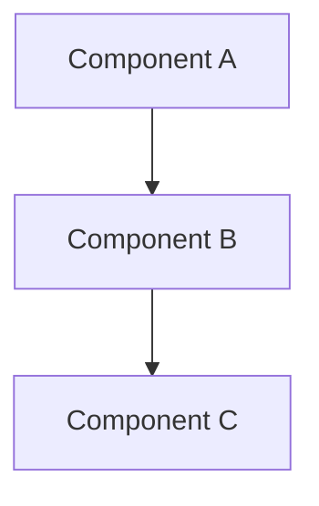

# Technical Specification: {{title}}

**Issue:** #{{issue_number}}  
**Version:** 1.0  
**Status:** Draft

---

## Overview

**Summary:**
{{description}}

**Objectives:**
1. [Objective 1]
2. [Objective 2]

## Architecture

### System Design



### Components

#### Component 1: [Name]
**Responsibility:** [What it does]

**Interfaces:**
- Input: [Description]
- Output: [Description]

**Dependencies:**
- [Dependency 1]

#### Component 2: [Name]
[Details...]

## Data Models

### Entity: [EntityName]

```csharp
public class EntityName
{
    public int Id { get; set; }
    public string Name { get; set; }
    public DateTime CreatedAt { get; set; }
}
```

**Fields:**
| Field | Type | Required | Description |
|-------|------|----------|-------------|
| Id | int | Yes | Primary key |
| Name | string | Yes | Entity name |

### Database Schema

```sql
CREATE TABLE entity_name (
    id SERIAL PRIMARY KEY,
    name VARCHAR(255) NOT NULL,
    created_at TIMESTAMP DEFAULT CURRENT_TIMESTAMP
);
```

## API Contracts

### Endpoint: [Endpoint Name]

**Method:** `GET /api/v1/resource`

**Request:**
```json
{
    "param1": "value1"
}
```

**Response:**
```json
{
    "data": [],
    "success": true
}
```

**Status Codes:**
- 200: Success
- 400: Bad request
- 401: Unauthorized
- 500: Server error

## Security

### Authentication
- [Method]

### Authorization
- [Rules]

### Data Protection
- [Encryption]
- [PII handling]

### Security Checklist
- [ ] Input validation
- [ ] SQL parameterization
- [ ] XSS prevention
- [ ] CSRF protection
- [ ] Rate limiting

## Performance

### Requirements
- Response time: < 200ms (p95)
- Throughput: > 1000 req/s
- Concurrency: 100 simultaneous users

### Optimization Strategies
- [Strategy 1]
- [Strategy 2]

### Caching
- [What to cache]
- [Cache invalidation]

## Testing Strategy

### Unit Tests
- Coverage target: ≥80%
- Key test cases:
  - [Test case 1]
  - [Test case 2]

### Integration Tests
- [Scenario 1]
- [Scenario 2]

### E2E Tests
- [User flow 1]

## Implementation Plan

### Phase 1: Foundation
**Tasks:**
1. [Task 1]
2. [Task 2]

**Deliverables:**
- [Deliverable 1]

### Phase 2: Core Features
[Details...]

### Phase 3: Polish & Optimization
[Details...]

## Monitoring & Observability

### Metrics
- [Metric 1]
- [Metric 2]

### Logging
- Log level: INFO
- Key events:
  - [Event 1]

### Alerts
- [Alert condition 1]

## Deployment

### Prerequisites
- [Requirement 1]

### Steps
1. [Step 1]
2. [Step 2]

### Rollback Plan
[Strategy]

## Risks & Mitigation

| Risk | Mitigation |
|------|------------|
| [Risk 1] | [Strategy] |

## Future Considerations

- [Enhancement 1]
- [Enhancement 2]

---

**Related Documents:**
- ADR: docs/adr/ADR-{{issue_number}}.md
- PRD: docs/prd/PRD-{{issue_number}}.md
