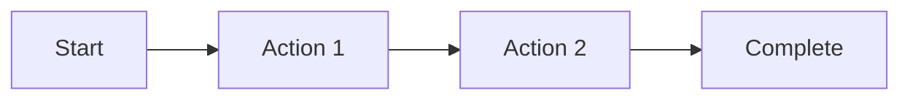

# UX Design: {{title}}

**Issue:** #{{issue_number}}  
**Designer:** AI-Squad UX Designer  
**Date:** [Date]

---

## Design Overview

**Goal:**
{{description}}

**Target Users:**
- [User persona 1]
- [User persona 2]

## User Flows

### Primary Flow



### Alternative Flows
- [Alt flow 1]

## Wireframes

### Screen 1: [Name]

```
+----------------------------------+
|  Header                    [X]   |
+----------------------------------+
|                                  |
|  [Main Content Area]             |
|                                  |
|  +--------------------------+    |
|  | Component 1              |    |
|  +--------------------------+    |
|                                  |
|  [Button]                        |
+----------------------------------+
|  Footer                          |
+----------------------------------+
```

**Purpose:** [What this screen does]

**Key Elements:**
- Header: [Description]
- Content: [Description]
- Actions: [Description]

### Screen 2: [Name]
[Wireframe...]

## Component Specifications

### Component: [Name]

**Purpose:** [What it does]

**States:**
- Default
- Hover
- Active
- Disabled

**Variants:**
- Primary
- Secondary

**Properties:**
| Property | Type | Default | Description |
|----------|------|---------|-------------|
| size | enum | medium | Size variant |
| disabled | boolean | false | Disabled state |

## Interaction Design

### Interactions
1. **[Interaction 1]**
   - Trigger: [Event]
   - Action: [What happens]
   - Feedback: [Visual feedback]

2. **[Interaction 2]**
   [Details...]

### Animations
- [Animation 1]: Duration 200ms, easing ease-out
- [Animation 2]: [Details]

## Responsive Design

### Breakpoints
- Mobile: 320px - 767px
- Tablet: 768px - 1023px
- Desktop: 1024px+

### Mobile Layout
```
+------------------+
| Stacked layout   |
+------------------+
```

### Desktop Layout
```
+--------------------+--------------------+
| Sidebar            | Main Content       |
+--------------------+--------------------+
```

## Accessibility

### WCAG 2.1 AA Compliance

**Checklist:**
- [ ] Proper heading hierarchy (h1-h6)
- [ ] Alt text for all images
- [ ] ARIA labels for interactive elements
- [ ] Keyboard navigation support
- [ ] Focus indicators visible
- [ ] Color contrast ratios ≥ 4.5:1
- [ ] Screen reader tested
- [ ] Form labels and error messages

### Keyboard Navigation
- Tab: Next element
- Shift+Tab: Previous element
- Enter/Space: Activate
- Esc: Close/Cancel

### Screen Reader Support
- [Consideration 1]
- [Consideration 2]

## Visual Design

### Colors
- Primary: [Color code]
- Secondary: [Color code]
- Success: [Color code]
- Error: [Color code]

### Typography
- Headings: [Font family, sizes]
- Body: [Font family, size]
- Code: [Monospace font]

### Spacing
- Base unit: 8px
- Component spacing: 16px, 24px, 32px

## Error States

### Error Messages
- **[Error Type]:** "[Error message text]"
- **[Error Type]:** "[Error message text]"

### Validation
- Real-time validation: Yes/No
- Error display: Inline/Toast

## Loading States

### Skeleton Screens
```
[Loading placeholder animation]
```

### Spinners
- Small: 16px
- Medium: 24px
- Large: 48px

## Success States

### Confirmation Messages
- "[Success message]"

### Feedback
- Visual: [Description]
- Audio: [If applicable]

## Design System Integration

**Existing Components Used:**
- [Component 1]
- [Component 2]

**New Components:**
- [Component 3]

## Implementation Notes

**For Engineers:**
- [Note 1]
- [Note 2]

**Dependencies:**
- [Library/framework 1]

## Testing & Validation

### Usability Testing
- [ ] Task 1: [Can user complete X?]
- [ ] Task 2: [Can user find Y?]

### Device Testing
- [ ] Mobile (iOS)
- [ ] Mobile (Android)
- [ ] Tablet
- [ ] Desktop (Chrome/Firefox/Safari)

---

**Related Documents:**
- PRD: docs/prd/PRD-{{issue_number}}.md
- Spec: docs/specs/SPEC-{{issue_number}}.md
