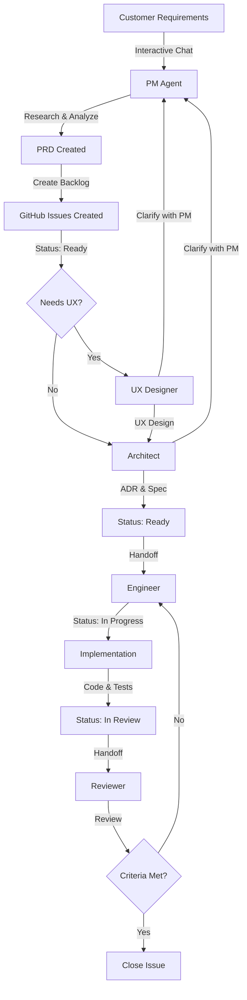

# AI-Squad Workflow Gap Analysis & Implementation Roadmap

> **Purpose**: Analyze gaps between current capabilities and desired end-to-end workflow  
> **Status**: Planning Phase  
> **Last Updated**: January 22, 2026  
> **Target Version**: 0.3.0+

---

## Executive Summary

AI-Squad currently provides **automated agent orchestration** through Watch Mode, but lacks critical features for a complete end-to-end workflow including interactive requirements gathering, status management, and agent-to-agent collaboration.

**Current Maturity**: 60% of desired workflow  
**Key Gaps**: Interactive chat, status management, agent collaboration, issue lifecycle  
**Estimated Effort**: 8-12 weeks (3 phases)

---

## Table of Contents

1. [Desired Workflow](#desired-workflow)
2. [Current State Analysis](#current-state-analysis)
3. [Gap Analysis](#gap-analysis)
4. [Implementation Roadmap](#implementation-roadmap)
5. [Technical Design](#technical-design)
6. [Success Criteria](#success-criteria)

---

## Desired Workflow

### Complete Feature Development Lifecycle



### Workflow Steps with Requirements

| Step | Agent | Action | Status Change | Handoff Mechanism |
|------|-------|--------|---------------|-------------------|
| 1 | Customer | Provides requirements via chat | - | Chat interface |
| 2 | PM | Research, analyze, create PRD | → Ready | Label + comment |
| 3 | PM | Prepare backlog (create issues) | Ready | GitHub API |
| 4 | UX/Architect | Clarify doubts with PM | - | Agent-to-agent comm |
| 5 | UX | Create wireframes & prototype | - | Artifacts |
| 6 | Architect | Design solution & ADR | - | Artifacts |
| 7 | Engineer | Implement code & tests | → In Progress | Label + status |
| 8 | Engineer | Complete implementation | → In Review | PR + label |
| 9 | Reviewer | Review code quality | - | Review doc |
| 10 | Reviewer | Close issue if approved | → Done | GitHub API |

---

## Current State Analysis

### ✅ What Works Today

#### 1. Automated Agent Orchestration (v0.2.0)
- **File**: `ai_squad/core/watch.py`
- **Command**: `squad watch`
- **Capabilities**:
  - Polls GitHub every 30s (configurable)
  - Detects orchestration labels (`orch:pm-done`, `orch:architect-done`, etc.)
  - Triggers next agent automatically
  - Adds labels and comments
  - Real-time status display
- **Flow**: PM → Architect → Engineer → Reviewer

#### 2. Individual Agent Commands
- `squad pm <issue>` - Creates PRD, can break down epics
- `squad architect <issue>` - Creates ADR and technical spec
- `squad ux <issue>` - Creates UX design and HTML prototype
- `squad engineer <issue>` - Implements code with tests
- `squad review <pr>` - Reviews code and creates report

#### 3. Multi-Agent Collaboration
- **File**: `ai_squad/core/collaboration.py`
- **Command**: `squad collab <issue> pm architect engineer`
- **Capabilities**: Sequential execution of multiple agents

#### 4. GitHub Integration
- Read issues and PRs
- Add comments
- Add labels
- Search issues by labels
- Get issue/PR details

#### 5. Skills & Templates
- 18 production skills (testing, security, API design, etc.)
- Templates for PRD, ADR, Spec, UX, Review
- Codebase search and context gathering

### ⚠️ Limitations

1. **No Interactive Chat** - All inputs must be GitHub issues
2. **No Status Management** - Only uses labels, not GitHub issue status
3. **No Agent Communication** - Agents cannot ask questions or clarify
4. **No Automatic Issue Closure** - Reviewer doesn't close issues
5. **Limited Backlog Management** - PM creates issues but no project board integration
6. **No Handoff Validation** - No checks that prerequisites are complete
7. **No Chat Agent** - Placeholder only (`squad chat` not implemented)

---

## Gap Analysis

### Priority 1: Critical Gaps (Blocking Workflow)

#### Gap 1.1: Interactive Chat Mode for Requirements Gathering
**Current State**: ❌ Not implemented (placeholder only)  
**Desired State**: Customer can chat with PM agent to discuss requirements  
**Impact**: **HIGH** - Blocks initial requirements gathering  
**Effort**: Medium (2-3 weeks)

**What's Missing**:
- Interactive terminal chat interface
- Multi-turn conversation with context
- Requirements extraction and structuring
- Chat history persistence
- Ability to create issues from chat
- Integration with PM agent

**Technical Requirements**:
```python
# Desired usage
squad chat pm

# Interactive session:
PM Agent: "Hi! Let's discuss your requirements. What feature would you like to build?"
User: "I need a user authentication system with OAuth"
PM Agent: "Great! What OAuth providers do you want to support?"
User: "Google and GitHub"
PM Agent: "Should we support traditional email/password login as well?"
User: "Yes, as a fallback"
PM Agent: "Perfect! Let me create a GitHub issue with these requirements..."
# Creates issue automatically
```

#### Gap 1.2: GitHub Issue Status Management
**Current State**: ❌ Only uses labels, no status field integration  
**Desired State**: Agents update issue status (Ready, In Progress, In Review, Done)  
**Impact**: **HIGH** - Critical for workflow visibility  
**Effort**: Low (1 week)

**What's Missing**:
- Status field updates via GitHub API
- Status transition validation
- Project board integration
- Status-based filtering in watch mode
- Custom status support

**Technical Requirements**:
```python
# Desired API
github.update_issue_status(issue_number, "In Progress")
github.transition_status(issue_number, from_status="Ready", to_status="In Progress")

# Project board support
github.move_issue_to_column(issue_number, column="In Progress")
```

#### Gap 1.3: Automatic Issue Lifecycle Management
**Current State**: ❌ Issues remain open after completion  
**Desired State**: Reviewer closes issues when criteria met  
**Impact**: **HIGH** - Incomplete workflow  
**Effort**: Low (1 week)

**What's Missing**:
- Acceptance criteria validation
- Automatic issue closure by Reviewer
- Issue reopening if criteria not met
- Closure comments with summary
- Linked PR validation

**Technical Requirements**:
```python
# In Reviewer agent
def _execute_agent(self, issue, context):
    # ... perform review ...
    
    if all_criteria_met:
        github.close_issue(
            issue_number,
            comment="✅ All acceptance criteria met. Closing issue."
        )
        github.add_label(issue_number, "orch:completed")
```

### Priority 2: Important Gaps (Enhancing Workflow)

#### Gap 2.1: Agent-to-Agent Communication
**Current State**: ❌ Agents work independently, no communication  
**Desired State**: Agents can ask questions and clarify with other agents  
**Impact**: **MEDIUM** - Improves quality and reduces assumptions  
**Effort**: High (3-4 weeks)

**What's Missing**:
- Inter-agent messaging system
- Question/answer protocol
- Context sharing between agents
- Clarification tracking
- Conversation history

**Technical Requirements**:
```python
# Desired usage
# UX Designer asks PM for clarification
class UXDesignerAgent(BaseAgent):
    def _execute_agent(self, issue, context):
        # Need clarification
        clarification = self.ask_agent(
            agent="pm",
            question="Should the login form support remember me checkbox?",
            context={"issue": issue, "current_design": self.draft_design}
        )
        
        # PM responds
        # UX continues with answer
```

#### Gap 2.2: Backlog & Project Board Integration
**Current State**: ⚠️ PM creates issues but no project board management  
**Desired State**: PM manages backlog in GitHub Projects  
**Impact**: **MEDIUM** - Better project management  
**Effort**: Medium (2 weeks)

**What's Missing**:
- GitHub Projects v2 API integration
- Backlog prioritization
- Sprint planning support
- Issue ordering/ranking
- Custom field management

**Technical Requirements**:
```python
# Desired API
github.add_to_project(issue_number, project_id="MyProject")
github.set_field_value(issue_number, field="Priority", value="High")
github.set_field_value(issue_number, field="Sprint", value="Sprint 5")
github.order_issues(project_id, issue_numbers=[123, 124, 125])
```

#### Gap 2.3: Handoff Validation & Prerequisites
**Current State**: ❌ No validation that prerequisites are complete  
**Desired State**: Validate prerequisites before agent execution  
**Impact**: **MEDIUM** - Prevents incomplete handoffs  
**Effort**: Low (1 week)

**What's Missing**:
- Prerequisite checking
- Artifact validation
- Dependency detection
- Warning system
- Skip/override options

**Technical Requirements**:
```python
# Before Engineer runs
def validate_prerequisites(self, issue_number):
    checks = {
        "prd_exists": self.check_prd_exists(issue_number),
        "spec_exists": self.check_spec_exists(issue_number),
        "ux_needed": self.check_ux_needed(issue_number),
    }
    
    if not all(checks.values()):
        raise PrerequisiteError(
            "Missing prerequisites. Run architect first.",
            checks=checks
        )
```

### Priority 3: Nice-to-Have Features

#### Gap 3.1: Rich Chat UI with Web Interface
**Current State**: ❌ No GUI  
**Desired State**: Optional web interface for chat  
**Impact**: **LOW** - UX improvement  
**Effort**: High (4 weeks)

#### Gap 3.2: Real-time Collaboration Dashboard
**Current State**: ⚠️ Watch mode shows basic status  
**Desired State**: Rich dashboard showing workflow progress  
**Impact**: **LOW** - Visibility improvement  
**Effort**: Medium (2 weeks)

#### Gap 3.3: Multi-Issue Workflow Orchestration
**Current State**: ⚠️ Watch mode handles one issue at a time  
**Desired State**: Parallel processing of multiple issues  
**Impact**: **LOW** - Performance improvement  
**Effort**: Medium (2 weeks)

---

## Implementation Roadmap

### Phase 1: Core Workflow Completion (v0.3.0)
**Timeline**: 4-5 weeks  
**Goal**: Complete basic end-to-end workflow with status management

#### Week 1-2: Issue Status Management
- [ ] **Task 1.1**: Implement GitHub status field integration
  - Add `update_issue_status()` method to `GitHubTool`
  - Add status transition validation
  - Update Watch Mode to track status changes
- [ ] **Task 1.2**: Add status management to all agents
  - PM: Set status to "Ready" after PRD
  - Engineer: Set to "In Progress" on start, "In Review" on completion
  - Reviewer: Set to "Done" after approval
- [ ] **Task 1.3**: Add project board support
  - Integrate GitHub Projects v2 API
  - Implement column/status mapping

**Deliverables**:
- ✅ `ai_squad/tools/github.py` - Status management methods
- ✅ Updated agents with status transitions
- ✅ Documentation: Status workflow guide

#### Week 3-4: Automatic Issue Lifecycle
- [ ] **Task 2.1**: Implement acceptance criteria validation
  - Add criteria parsing from PRD
  - Create validation framework
- [ ] **Task 2.2**: Add automatic issue closure to Reviewer
  - Check all criteria met
  - Close issue with summary comment
  - Handle edge cases (linked PRs, blockers)
- [ ] **Task 2.3**: Add reopening logic
  - Reopen if criteria not met
  - Add labels and comments explaining issues

**Deliverables**:
- ✅ Enhanced Reviewer agent with closure logic
- ✅ Acceptance criteria framework
- ✅ Tests for lifecycle management

#### Week 5: Integration & Testing
- [ ] **Task 3.1**: End-to-end workflow testing
- [ ] **Task 3.2**: Documentation updates
- [ ] **Task 3.3**: Bug fixes and polish
- [ ] **Task 3.4**: Release v0.3.0

**Deliverables**:
- ✅ Comprehensive workflow tests
- ✅ Updated documentation
- ✅ v0.3.0 release

### Phase 2: Interactive Requirements & Communication (v0.4.0)
**Timeline**: 4-5 weeks  
**Goal**: Add interactive chat and agent-to-agent communication

#### Week 1-2: Interactive Chat Mode
- [ ] **Task 1.1**: Design chat interface architecture
  - Terminal-based chat UI
  - Conversation state management
  - Context persistence
- [ ] **Task 1.2**: Implement `squad chat pm` command
  - Multi-turn conversation
  - Requirements extraction
  - Issue creation from chat
- [ ] **Task 1.3**: Add chat history and session management
  - Store conversations
  - Resume sessions
  - Export to PRD

**Deliverables**:
- ✅ `ai_squad/core/chat.py` - Chat framework
- ✅ `squad chat` command
- ✅ Chat UI with Rich library

**Technical Design**:
```python
# ai_squad/core/chat.py
class ChatSession:
    def __init__(self, agent_type: str):
        self.agent = self._create_agent(agent_type)
        self.history = []
        self.context = {}
    
    def send(self, message: str) -> str:
        """Send message and get response"""
        self.history.append({"role": "user", "content": message})
        response = self.agent.respond(message, self.history)
        self.history.append({"role": "assistant", "content": response})
        return response
    
    def create_issue(self) -> int:
        """Create GitHub issue from conversation"""
        requirements = self._extract_requirements()
        return self.github.create_issue(requirements)
```

#### Week 3-4: Agent-to-Agent Communication
- [ ] **Task 2.1**: Design inter-agent messaging protocol
  - Message format
  - Routing system
  - Async communication
- [ ] **Task 2.2**: Implement agent communication framework
  - `ask_agent()` method
  - Response handling
  - Timeout management
- [ ] **Task 2.3**: Add clarification support to agents
  - UX asks PM for clarifications
  - Architect asks PM for constraints
  - Engineer asks Architect for details

**Deliverables**:
- ✅ `ai_squad/core/agent_comm.py` - Communication framework
- ✅ Updated agents with communication support
- ✅ Communication examples and docs

#### Week 5: Testing & Release
- [ ] **Task 3.1**: Integration testing
- [ ] **Task 3.2**: Documentation
- [ ] **Task 3.3**: Release v0.4.0

### Phase 3: Advanced Features (v0.5.0)
**Timeline**: 4 weeks  
**Goal**: Enhanced backlog management and collaboration features

#### Week 1-2: Enhanced Backlog Management
- [ ] **Task 1.1**: GitHub Projects v2 full integration
- [ ] **Task 1.2**: Priority and sprint management
- [ ] **Task 1.3**: Custom fields support
- [ ] **Task 1.4**: Backlog grooming features

#### Week 3: Handoff Validation
- [ ] **Task 2.1**: Prerequisite checking framework
- [ ] **Task 2.2**: Artifact validation
- [ ] **Task 2.3**: Dependency management

#### Week 4: Polish & Release
- [ ] **Task 3.1**: Performance optimization
- [ ] **Task 3.2**: Error handling improvements
- [ ] **Task 3.3**: Documentation completion
- [ ] **Task 3.4**: Release v0.5.0

---

## Technical Design

### 1. Status Management Architecture

```python
# ai_squad/core/status.py
from enum import Enum
from typing import Optional, List

class IssueStatus(Enum):
    """Standard issue statuses"""
    BACKLOG = "Backlog"
    READY = "Ready"
    IN_PROGRESS = "In Progress"
    IN_REVIEW = "In Review"
    DONE = "Done"
    BLOCKED = "Blocked"

class StatusManager:
    """Manages issue status transitions"""
    
    VALID_TRANSITIONS = {
        IssueStatus.BACKLOG: [IssueStatus.READY, IssueStatus.BLOCKED],
        IssueStatus.READY: [IssueStatus.IN_PROGRESS, IssueStatus.BLOCKED],
        IssueStatus.IN_PROGRESS: [IssueStatus.IN_REVIEW, IssueStatus.BLOCKED],
        IssueStatus.IN_REVIEW: [IssueStatus.IN_PROGRESS, IssueStatus.DONE],
        IssueStatus.BLOCKED: [IssueStatus.READY, IssueStatus.IN_PROGRESS],
        IssueStatus.DONE: [],  # Terminal state
    }
    
    def transition(self, issue_number: int, 
                   from_status: IssueStatus,
                   to_status: IssueStatus) -> bool:
        """Transition issue status with validation"""
        if to_status not in self.VALID_TRANSITIONS[from_status]:
            raise InvalidTransitionError(
                f"Cannot transition from {from_status} to {to_status}"
            )
        
        self.github.update_issue_status(issue_number, to_status.value)
        self.github.add_comment(
            issue_number,
            f"Status changed: {from_status.value} → {to_status.value}"
        )
        return True
```

### 2. Chat Interface Architecture

```python
# ai_squad/core/chat.py
from rich.console import Console
from rich.panel import Panel
from rich.prompt import Prompt
from typing import List, Dict

class ChatInterface:
    """Interactive chat interface for agents"""
    
    def __init__(self, agent_type: str):
        self.console = Console()
        self.session = ChatSession(agent_type)
        self.agent_name = agent_type.title()
    
    def start(self):
        """Start interactive chat session"""
        self._print_welcome()
        
        while True:
            user_input = Prompt.ask(f"[bold cyan]You[/bold cyan]")
            
            if user_input.lower() in ["exit", "quit", "bye"]:
                self._handle_exit()
                break
            
            if user_input.lower() == "create issue":
                self._create_issue()
                continue
            
            # Get agent response
            response = self.session.send(user_input)
            self._print_agent_message(response)
    
    def _print_agent_message(self, message: str):
        """Print agent response"""
        self.console.print(Panel(
            message,
            title=f"[bold green]{self.agent_name} Agent[/bold green]",
            border_style="green"
        ))
    
    def _create_issue(self):
        """Create GitHub issue from conversation"""
        self.console.print("[yellow]Creating issue from conversation...[/yellow]")
        issue_number = self.session.create_issue()
        self.console.print(f"[green]✅ Created issue #{issue_number}[/green]")
```

### 3. Agent Communication Protocol

```python
# ai_squad/core/agent_comm.py
from typing import Dict, Any, Optional
from dataclasses import dataclass
import uuid
from datetime import datetime

@dataclass
class AgentMessage:
    """Message between agents"""
    id: str
    from_agent: str
    to_agent: str
    message_type: str  # "question", "response", "notification"
    content: str
    context: Dict[str, Any]
    timestamp: datetime
    response_to: Optional[str] = None

class AgentCommunicator:
    """Handles inter-agent communication"""
    
    def __init__(self):
        self.message_queue = []
        self.responses = {}
    
    def ask(self, from_agent: str, to_agent: str, 
            question: str, context: Dict) -> str:
        """Ask another agent a question and wait for response"""
        
        message = AgentMessage(
            id=str(uuid.uuid4()),
            from_agent=from_agent,
            to_agent=to_agent,
            message_type="question",
            content=question,
            context=context,
            timestamp=datetime.now()
        )
        
        # Route to target agent
        response = self._route_message(message)
        return response
    
    def _route_message(self, message: AgentMessage) -> str:
        """Route message to target agent and get response"""
        target_agent = self._get_agent(message.to_agent)
        
        # Agent processes message and responds
        response = target_agent.handle_message(message)
        
        return response
```

### 4. Enhanced Watch Mode with Status Tracking

```python
# ai_squad/core/watch.py (enhanced)
class EnhancedWatchDaemon(WatchDaemon):
    """Watch daemon with status management"""
    
    AGENT_TRIGGERS = {
        IssueStatus.READY: "architect",
        IssueStatus.IN_REVIEW: "reviewer",
    }
    
    def _check_for_triggers(self) -> List[Dict]:
        """Check for status changes"""
        events = []
        
        # Check status-based triggers
        for status, agent in self.AGENT_TRIGGERS.items():
            issues = self.github.get_issues_by_status(status.value)
            
            for issue in issues:
                # Check if agent already ran
                if not self._has_agent_completed(issue, agent):
                    events.append({
                        "issue": issue,
                        "agent": agent,
                        "trigger": f"status:{status.value}"
                    })
        
        return events
    
    def _handle_event(self, event: Dict) -> bool:
        """Handle event with status updates"""
        issue = event["issue"]
        agent = event["agent"]
        
        # Update status
        if agent == "engineer":
            self.status_mgr.transition(
                issue["number"],
                IssueStatus.READY,
                IssueStatus.IN_PROGRESS
            )
        
        # Execute agent
        result = super()._handle_event(event)
        
        # Update status after completion
        if result and agent == "engineer":
            self.status_mgr.transition(
                issue["number"],
                IssueStatus.IN_PROGRESS,
                IssueStatus.IN_REVIEW
            )
        
        return result
```

---

## Success Criteria

### Phase 1 Success Metrics
- [ ] 100% of issues have status field set correctly
- [ ] Reviewer automatically closes issues when criteria met
- [ ] Watch mode tracks status transitions
- [ ] Zero manual status updates needed
- [ ] Project board integration working

### Phase 2 Success Metrics
- [ ] `squad chat pm` functional for requirements gathering
- [ ] Users can create issues from chat sessions
- [ ] Agents can ask clarification questions
- [ ] Chat history persisted and resumable
- [ ] Agent-to-agent communication reduces errors by 30%

### Phase 3 Success Metrics
- [ ] Full GitHub Projects v2 integration
- [ ] Backlog management features operational
- [ ] Prerequisite validation prevents 90% of incomplete handoffs
- [ ] Custom fields and sprint planning supported

### Overall Workflow Success
- [ ] Complete workflow from chat to closure works end-to-end
- [ ] Zero manual intervention needed for status updates
- [ ] Agents collaborate automatically when needed
- [ ] Issues close automatically when approved
- [ ] Developer satisfaction score: 8+/10

---

## Risk Assessment

| Risk | Impact | Likelihood | Mitigation |
|------|--------|------------|------------|
| GitHub API rate limits | High | Medium | Add caching, batch operations |
| Agent response quality | High | Low | Improve prompts, add validation |
| Chat UI complexity | Medium | Medium | Start with terminal, iterate |
| Inter-agent deadlocks | Medium | Low | Add timeouts, max retries |
| Status conflicts | Medium | Low | Pessimistic locking, validation |
| Integration testing complexity | Medium | High | Mock GitHub API, test fixtures |

---

## Dependencies

### External Dependencies
- **GitHub API**: Status fields, Projects v2 API
- **GitHub Copilot SDK**: Chat completions, streaming
- **Rich Library**: Terminal UI for chat

### Internal Dependencies
- Enhanced `GitHubTool` class
- Updated agent base class
- New communication framework
- Status management system

---

## Open Questions

1. **Chat Persistence**: Where to store chat history? (Local file, GitHub issue comments, database?)
2. **Agent Communication**: Synchronous or asynchronous? (Start with sync, add async later?)
3. **Status Customization**: Support custom statuses per repo? (Yes, use config file)
4. **Multi-User**: How to handle multiple devs chatting with PM? (One session per user)
5. **Web UI**: Build web interface or keep terminal-only? (Phase 4 consideration)

---

## Next Steps

### Immediate Actions (This Week)
1. **Review & Approve**: Review this document with stakeholders
2. **Prioritize**: Confirm Phase 1 as immediate priority
3. **Setup**: Create feature branches for Phase 1 work
4. **Design Review**: Deep dive on status management design

### Week 2 Start
1. Begin Task 1.1: GitHub status field integration
2. Write technical specs for status manager
3. Create test fixtures and mocks
4. Update project documentation

---

## References

- [Current Watch Mode Implementation](WATCH-MODE-IMPLEMENTATION.md)
- [Automation Design](AUTOMATION-DESIGN.md)
- [Agents Guide](agents.md)
- [GitHub Projects v2 API](https://docs.github.com/en/issues/planning-and-tracking-with-projects/automating-your-project/using-the-api-to-manage-projects)
- [GitHub Issue Status Fields](https://docs.github.com/en/issues/tracking-your-work-with-issues/about-issues)

---

**Document Owner**: AI-Squad Team  
**Last Review**: January 22, 2026  
**Next Review**: February 5, 2026 (after Phase 1 kickoff)
