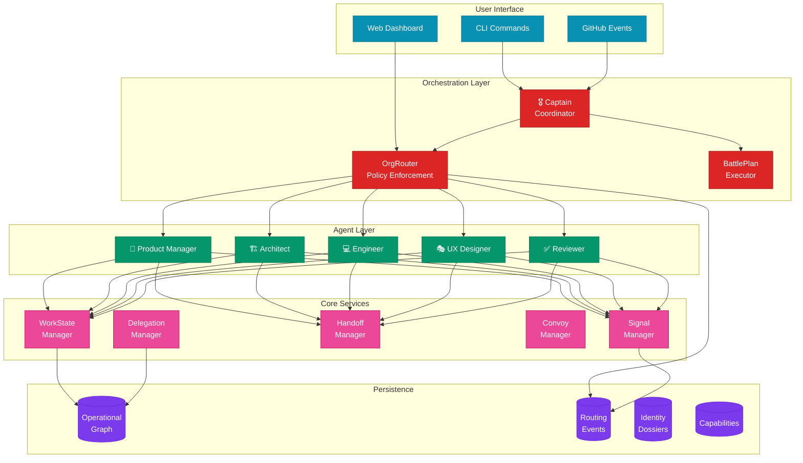
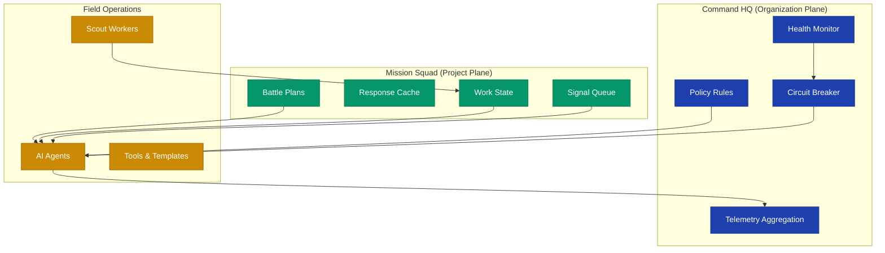
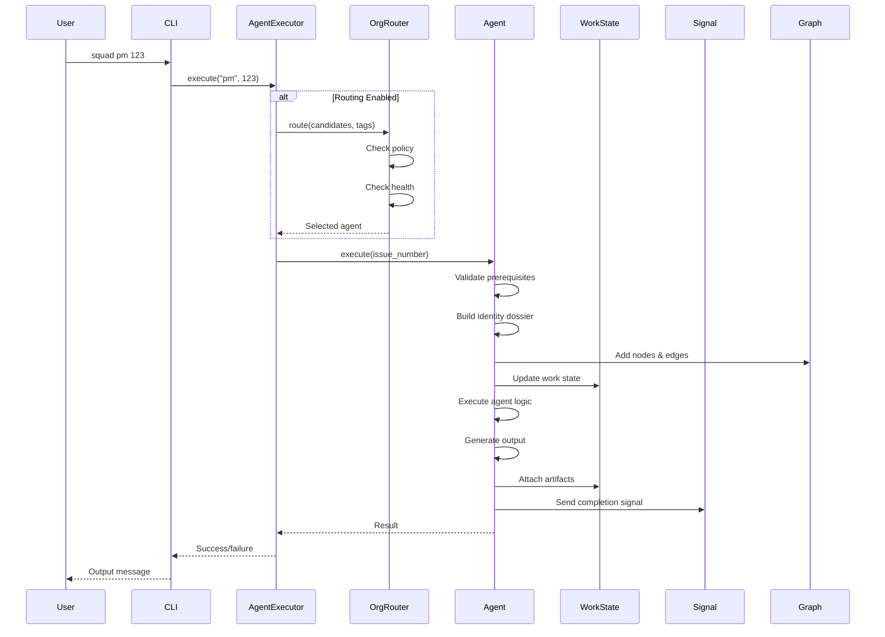
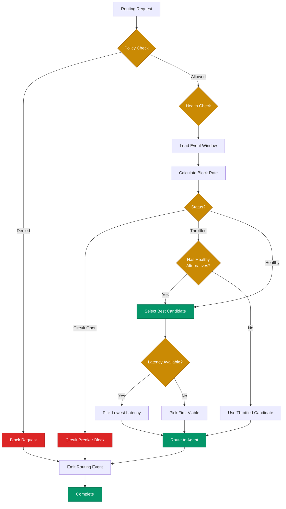
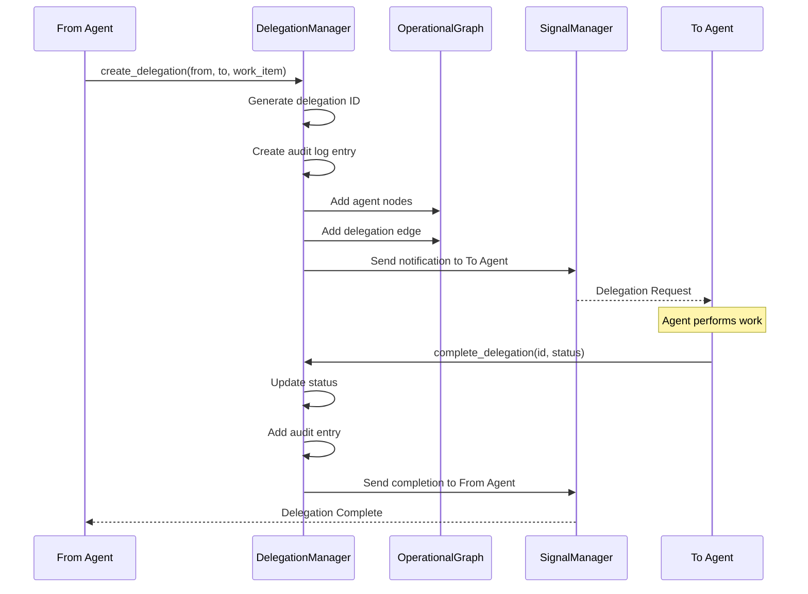
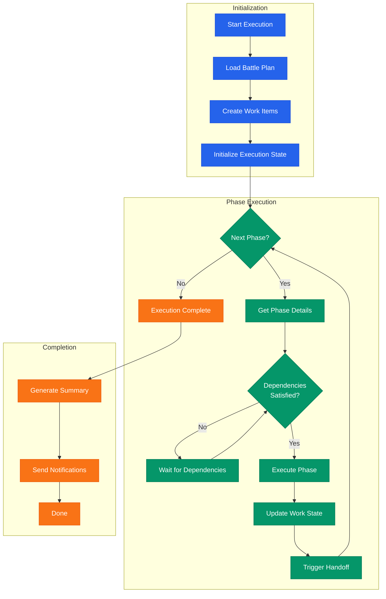
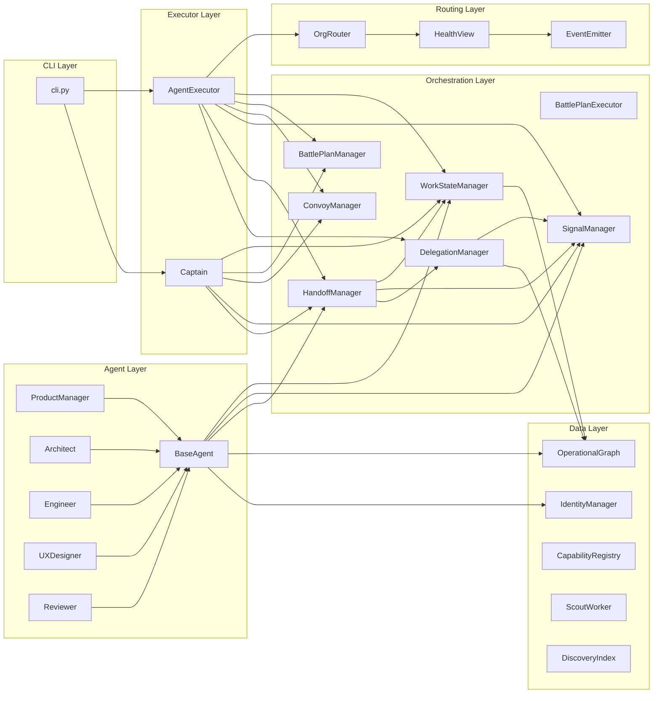
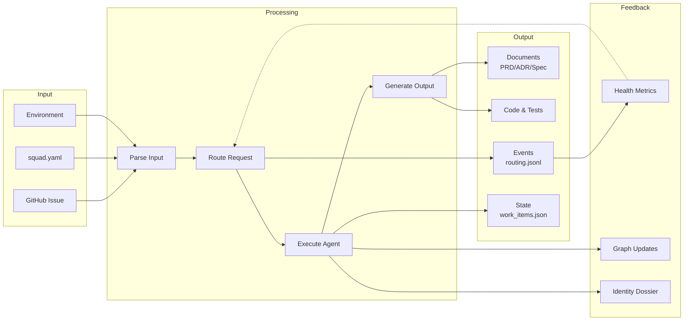
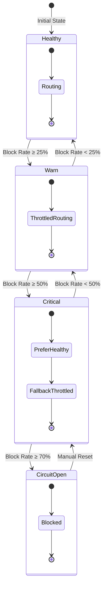
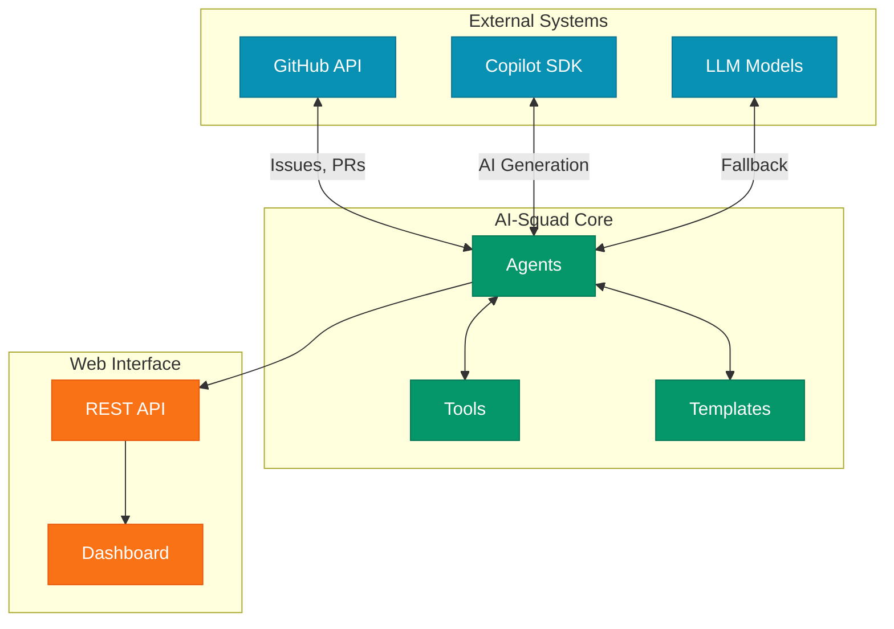

# AI-Squad Architecture Diagrams

This document provides visual representations of the AI-Squad orchestration architecture.

## Table of Contents

1. [System Overview](#system-overview)
2. [Control Planes](#control-planes)
3. [Agent Workflow](#agent-workflow)
4. [Routing Flow](#routing-flow)
5. [Delegation Flow](#delegation-flow)
6. [Battle Plan Execution](#battle-plan-execution)
7. [Component Dependencies](#component-dependencies)

---

## System Overview



---

## Control Planes



---

## Agent Workflow



---

## Routing Flow



---

## Delegation Flow



---

## Battle Plan Execution



---

## Component Dependencies



---

## Data Flow Diagram



---

## Storage Structure

```
.squad/
├── capabilities/
│   ├── installed.json         # Installed packages registry
│   ├── signature.key          # Optional signature verification key
│   └── <pkg-name>-<version>/  # Installed package contents
├── delegations/
│   └── delegations.json       # Delegation links with audit trails
├── discovery/
│   └── remotes.json           # Remote discovery metadata
├── events/
│   └── routing.jsonl          # Routing events (JSONL format)
├── graph/
│   ├── nodes.json             # Operational graph nodes
│   └── edges.json             # Operational graph edges
├── handoffs/
│   └── handoffs.json          # Handoff records
├── identity/
│   └── identity.json          # Current identity dossier
├── scout_workers/
│   └── scout-*.json           # Scout run checkpoints
├── signals/
│   └── messages.json          # Signal messages
└── work_items/
    └── work_items.json        # Work item state
```

---

## Health Status Flow



---

## Integration Points



---

## Summary

The AI-Squad architecture follows a layered design:

1. **User Interface Layer** - CLI and Web Dashboard
2. **Orchestration Layer** - Captain, Router, Battle Plans
3. **Agent Layer** - Five specialized agents
4. **Core Services Layer** - State, signals, handoffs, delegations
5. **Persistence Layer** - Graph, events, identity, capabilities

Key principles:
- **Policy-driven routing** with health-aware decisions
- **Explicit delegation** with audit trails
- **Operational graph** for dependency tracking
- **Event sourcing** for telemetry
- **Identity dossiers** for provenance

All components communicate through well-defined interfaces and persist state to the `.squad/` directory structure.
