# AI-Squad Architecture Diagrams

This document provides visual representations of the AI-Squad orchestration architecture.

## Table of Contents

1. [System Overview](#system-overview)
2. [Control Planes](#control-planes)
3. [Agent Workflow](#agent-workflow)
4. [Routing Flow](#routing-flow)
5. [Delegation Flow](#delegation-flow)
6. [Battle Plan Execution](#battle-plan-execution)
7. [Component Dependencies](#component-dependencies)

---

## System Overview

```mermaid
graph TB
    subgraph "User Interface"
        CLI[CLI Commands]
        Dashboard[Web Dashboard]
        GH[GitHub Events]
    end
    
    subgraph "Orchestration Layer"
        Captain[🎖️ Captain<br/>Coordinator]
        Router[OrgRouter<br/>Policy Enforcement]
        BPE[BattlePlan<br/>Executor]
    end
    
    subgraph "Agent Layer"
        PM[🎨 Product Manager]
        Arch[🏗️ Architect]
        Eng[💻 Engineer]
        UX[🎭 UX Designer]
        Rev[✅ Reviewer]
    end
    
    subgraph "Core Services"
        WS[WorkState<br/>Manager]
        Signal[Signal<br/>Manager]
        Handoff[Handoff<br/>Manager]
        Convoy[Convoy<br/>Manager]
        Del[Delegation<br/>Manager]
    end
    
    subgraph "Persistence"
        Graph[(Operational<br/>Graph)]
        Events[(Routing<br/>Events)]
        Identity[(Identity<br/>Dossiers)]
        Caps[(Capabilities)]
    end
    
    CLI --> Captain
    Dashboard --> Router
    GH --> Captain
    
    Captain --> Router
    Captain --> BPE
    Router --> PM & Arch & Eng & UX & Rev
    
    PM & Arch & Eng & UX & Rev --> WS
    PM & Arch & Eng & UX & Rev --> Signal
    PM & Arch & Eng & UX & Rev --> Handoff
    
    WS --> Graph
    Router --> Events
    Signal --> Events
    Del --> Graph
    
    classDef user fill:#0891b2,stroke:#0e7490,color:#fff
    classDef orch fill:#dc2626,stroke:#991b1b,color:#fff
    classDef agent fill:#059669,stroke:#047857,color:#fff
    classDef core fill:#ec4899,stroke:#be185d,color:#fff
    classDef persist fill:#7c3aed,stroke:#6d28d9,color:#fff
    
    class CLI,Dashboard,GH user
    class Captain,Router,BPE orch
    class PM,Arch,Eng,UX,Rev agent
    class WS,Signal,Handoff,Convoy,Del core
    class Graph,Events,Identity,Caps persist
```



---

## Control Planes


---

## Agent Workflow


---

## Routing Flow


---

## Delegation Flow


---

## Battle Plan Execution


---

## Component Dependencies


---

## Data Flow Diagram


---

## Storage Structure

```
.squad/
├── capabilities/
│   ├── installed.json         # Installed packages registry
│   ├── signature.key          # Optional signature verification key
│   └── <pkg-name>-<version>/  # Installed package contents
├── delegations/
│   └── delegations.json       # Delegation links with audit trails
├── discovery/
│   └── remotes.json           # Remote discovery metadata
├── events/
│   └── routing.jsonl          # Routing events (JSONL format)
├── graph/
│   ├── nodes.json             # Operational graph nodes
│   └── edges.json             # Operational graph edges
├── handoffs/
│   └── handoffs.json          # Handoff records
├── identity/
│   └── identity.json          # Current identity dossier
├── scout_workers/
│   └── scout-*.json           # Scout run checkpoints
├── signals/
│   └── messages.json          # Signal messages
└── work_items/
    └── work_items.json        # Work item state
```

---

## Health Status Flow

```mermaid
stateDiagram-v2
    [*] --> Healthy: Initial State
    
    Healthy --> Warn: Block Rate ≥ 25%
    Warn --> Healthy: Block Rate < 25%
    
    Warn --> Critical: Block Rate ≥ 50%
    Critical --> Warn: Block Rate < 50%
    
    Critical --> CircuitOpen: Block Rate ≥ 70%
    CircuitOpen --> Critical: Manual Reset
    
    state Healthy {
        [*] --> Routing
        Routing --> [*]
    }
    
    state Warn {
        [*] --> ThrottledRouting
        ThrottledRouting --> [*]
    }
    
    state Critical {
        [*] --> PreferHealthy
        PreferHealthy --> FallbackThrottled
        FallbackThrottled --> [*]
    }
    
    state CircuitOpen {
        [*] --> Blocked
        Blocked --> [*]
    }
```



---

## Integration Points


---

## Summary

The AI-Squad architecture follows a layered design:

1. **User Interface Layer** - CLI and Web Dashboard
2. **Orchestration Layer** - Captain, Router, Battle Plans
3. **Agent Layer** - Five specialized agents
4. **Core Services Layer** - State, signals, handoffs, delegations
5. **Persistence Layer** - Graph, events, identity, capabilities

Key principles:
- **Policy-driven routing** with health-aware decisions
- **Explicit delegation** with audit trails
- **Operational graph** for dependency tracking
- **Event sourcing** for telemetry
- **Identity dossiers** for provenance

All components communicate through well-defined interfaces and persist state to the `.squad/` directory structure.
