# AI-Squad Architecture Diagrams

This document provides visual representations of the AI-Squad orchestration architecture.

## Table of Contents

1. [System Overview](#system-overview)
2. [Agent Workflow](#agent-workflow)
3. [Battle Plan Execution](#battle-plan-execution)
4. [Storage Structure](#storage-structure)
5. [Integration Points](#integration-points)
6. [Summary](#summary)

---

## System Overview

```mermaid
graph TB
    subgraph "User Interface"
        CLI[CLI Commands]
        Dashboard[Web Dashboard]
        GH[GitHub Events]
    end
    
    subgraph "Orchestration Layer"
        Captain[🎖️ Captain<br/>Coordinator]
        Executor[AgentExecutor]
        BPE[Battle Plan<br/>Runner]
    end
    
    subgraph "Agent Layer"
        PM[🎨 Product Manager]
        Arch[📐 Architect]
        Eng[💻 Engineer]
        UX[🎭 UX Designer]
        Rev[✅ Reviewer]
    end
    
    subgraph "Core Services"
        WS[WorkState<br/>Manager]
        Hooks[Hook<br/>Manager]
        Workers[Worker<br/>Lifecycle]
        Graph[Operational<br/>Graph]
        Providers[Provider<br/>Chain]
    end
    
    subgraph "Persistence"
        State[(.squad/workstate.json)]
        HookStore[(.squad/hooks)]
        WorkerStore[(.squad/workers.json)]
        GraphStore[(.squad/graph.json)]
    end
    
    CLI --> Captain
    Dashboard --> Captain
    GH --> Captain

    Captain --> Executor
    Captain --> BPE
    Executor --> PM & Arch & Eng & UX & Rev

    PM & Arch & Eng & UX & Rev --> WS
    PM & Arch & Eng & UX & Rev --> Hooks
    PM & Arch & Eng & UX & Rev --> Workers
    PM & Arch & Eng & UX & Rev --> Graph
    PM & Arch & Eng & UX & Rev --> Providers

    WS --> State
    Hooks --> HookStore
    Workers --> WorkerStore
    Graph --> GraphStore
    
    classDef user fill:#0891b2,stroke:#0e7490,color:#fff
    classDef orch fill:#dc2626,stroke:#991b1b,color:#fff
    classDef agent fill:#059669,stroke:#047857,color:#fff
    classDef core fill:#ec4899,stroke:#be185d,color:#fff
    classDef persist fill:#7c3aed,stroke:#6d28d9,color:#fff
    
    class CLI,Dashboard,GH user
    class Captain,Executor,BPE orch
    class PM,Arch,Eng,UX,Rev agent
    class WS,Hooks,Workers,Graph,Providers core
    class State,HookStore,WorkerStore,GraphStore persist
```



---

## Agent Workflow


---

## Battle Plan Execution


---

## Storage Structure

```
.squad/
├── workstate.json         # Work item state
├── workers.json           # Worker lifecycle records
├── graph.json             # Operational graph
└── hooks/                 # Hook snapshots (if enabled)
    └── <work_item_id>/
```

---

## Integration Points


---

## Summary

The AI-Squad architecture follows a layered design:

1. **User Interface Layer** - CLI and Web Dashboard
2. **Orchestration Layer** - Captain, AgentExecutor, Battle Plan runner
3. **Agent Layer** - Five specialized agents
4. **Core Services Layer** - WorkState, hooks, worker lifecycle, operational graph, provider chain
5. **Persistence Layer** - `.squad/` state files

All components communicate through well-defined interfaces and persist state to the `.squad/` directory structure.
