# AI-Squad Architecture Diagrams

This document provides visual representations of the AI-Squad orchestration architecture.

## Table of Contents

1. [System Overview](#system-overview)
2. [Agent Workflow](#agent-workflow)
3. [Battle Plan Execution](#battle-plan-execution)
4. [Storage Structure](#storage-structure)
5. [Integration Points](#integration-points)
6. [Summary](#summary)

---

## System Overview

```mermaid
graph TB
    subgraph "User Interface"
        CLI[CLI Commands]
        Dashboard[Web Dashboard]
        GH[GitHub Events]
    end
    
    subgraph "Orchestration Layer"
        Captain[🎖️ Captain<br/>Coordinator]
        Executor[AgentExecutor]
        BPE[Battle Plan<br/>Runner]
    end
    
    subgraph "Agent Layer"
        PM[🎨 Product Manager]
        Arch[🧩 Architect]
        Eng[🔧 Engineer]
        UX[🎭 UX Designer]
        Rev[🛡️ Reviewer]
    end
    
    subgraph "Core Services"
        WS[WorkState<br/>Manager]
        Hooks[Hook<br/>Manager]
        Workers[Worker<br/>Lifecycle]
        Graph[Operational<br/>Graph]
        Providers[Provider<br/>Chain]
    end
    
    subgraph "Persistence"
        State[(.squad/workstate.json)]
        HookStore[(.squad/hooks)]
        WorkerStore[(.squad/workers.json)]
        GraphStore[(.squad/graph.json)]
    end
    
    CLI --> Captain
    Dashboard --> Captain
    GH --> Captain

    Captain --> Executor
    Captain --> BPE
    Executor --> PM & Arch & Eng & UX & Rev

    PM & Arch & Eng & UX & Rev --> WS
    PM & Arch & Eng & UX & Rev --> Hooks
    PM & Arch & Eng & UX & Rev --> Workers
    PM & Arch & Eng & UX & Rev --> Graph
    PM & Arch & Eng & UX & Rev --> Providers

    WS --> State
    Hooks --> HookStore
    Workers --> WorkerStore
    Graph --> GraphStore
    
    classDef user fill:#0891b2,stroke:#0e7490,color:#fff
    classDef orch fill:#dc2626,stroke:#991b1b,color:#fff
    classDef agent fill:#059669,stroke:#047857,color:#fff
    classDef core fill:#ec4899,stroke:#be185d,color:#fff
    classDef persist fill:#7c3aed,stroke:#6d28d9,color:#fff
    
    class CLI,Dashboard,GH user
    class Captain,Executor,BPE orch
    class PM,Arch,Eng,UX,Rev agent
    class WS,Hooks,Workers,Graph,Providers core
    class State,HookStore,WorkerStore,GraphStore persist
```



---

## Agent Workflow


---

## Battle Plan Execution


---

## Storage Structure

```
.squad/
├── workstate.json         # Work item state
├── workers.json           # Worker lifecycle records
├── graph.json             # Operational graph
└── hooks/                 # Hook snapshots (if enabled)
    └── <work_item_id>/
```

---

## Integration Points


---

## Persistence Architecture: Memory, Session, WorkState & Signal

### **1. Memory (Implicit - No Dedicated Class)**
- **Pattern**: Ephemeral context storage within components
- **Location**: Embedded in:
  - `WorkItem.context` field (agent resumption context)
  - `Message.metadata` and `Message.attachments` fields
  - In-memory caches in managers (`_work_items`, `_handlers`)
- **Purpose**: Short-term context for agent operations
- **Note**: Memory is not a separate layer - it's embedded in WorkState and Signal systems

### **2. Session (Agent Lifecycle)**
- **Pattern**: Stateless, ephemeral execution context
- **Location**: `ai_provider.py` - Copilot SDK session handling
- **Characteristics**:
  - Created per AI provider request
  - Event-driven with callbacks (`on_event`)
  - Destroyed after completion (`session.destroy()`)
  - **No persistence** - purely runtime
- **Usage**: Only for AI model interactions, not agent state

### **3. WorkState (Persistent Agent State)**
- **Pattern**: **Single Source of Truth** with ACID transactions
- **Location**: `workstate.py` - `WorkStateManager`
- **Design Principles**:

#### **Core Components**:
```python
WorkItem (Dataclass)
├─ id, title, description
├─ status (WorkStatus enum: BACKLOG → READY → IN_PROGRESS → DONE)
├─ agent_assignee
├─ context (Dict) - Agent resumption state
├─ artifacts (List[str]) - Output files
├─ depends_on / blocks - Dependency graph
└─ convoy_id - Parallel execution grouping

WorkStateManager (Singleton Pattern)
├─ Persistence: .squad/workstate.json
├─ Locking: fcntl (POSIX) / msvcrt (Windows)
├─ Transactions: transaction() context manager
├─ Hooks: HookManager integration (git worktree attachments)
└─ Operations: CRUD + dependency resolution
```

#### **Key Design Patterns**:
1. **File-based Locking** - Prevents race conditions
2. **Transactional Updates** - Reload-modify-save pattern with `transaction()` context manager
3. **Atomic Writes** - Temp file → replace pattern prevents partial writes
4. **Git-Trackable** - `.squad/workstate.json` is human-readable JSON

### **4. Signal (Asynchronous Message Passing)**
- **Pattern**: **Pub/Sub + Persistent Queue** (inspired by military tactical comms)
- **Location**: `signal.py` - `SignalManager`
- **Design Principles**:

#### **Core Components**:
```python
Message (Dataclass)
├─ id, sender, recipient
├─ subject, body
├─ priority (LOW → URGENT)
├─ status (PENDING → DELIVERED → READ → ACKNOWLEDGED)
├─ thread_id (conversation threading)
├─ reply_to (message threading)
├─ work_item_id / convoy_id (context linking)
└─ expires_at (TTL)

Signal (Dataclass)
├─ owner (agent identifier)
├─ inbox (List[message_id])
├─ outbox (List[message_id])
└─ archived (List[message_id])

SignalManager (Singleton Pattern)
├─ Persistence: SQLite (history.db)
├─ Migration: Legacy JSON → SQLite
├─ Handlers: In-memory callbacks (MessageHandler)
└─ Broadcasting: "broadcast" recipient → all agents
```

#### **Key Design Patterns**:
1. **Dual Storage** - Migration from JSON to SQLite for better querying
2. **Event-Driven Callbacks** - Register handlers for agent message processing
3. **Stateful Delivery Tracking** - Full message lifecycle tracking
4. **Broadcast Support** - Registry-based routing to all agents

### **5. Storage (Unified Persistence Layer)**
- **Pattern**: **Repository Pattern** with SQLite backend
- **Location**: `storage.py` - `PersistentStorage`
- **Responsibilities**:
  - Agent Messages (agent_comm)
  - Status Transitions (audit trail)
  - Agent Executions (audit trail)
  - Signal Messages (SignalManager backend)
  - Agent Signals (inbox/outbox tracking)
  - Signal Owners (broadcast registry)

#### **Key Design Patterns**:
1. **Context Manager Pattern** - Automatic commit/rollback for ACID transactions
2. **Row Factory** - Type-safe ORM-like access with `sqlite3.Row`
3. **Indexed Queries** - Performance optimization for common queries
4. **Separation of Concerns** - WorkState uses JSON (git-trackable), Signal uses SQLite (efficient querying)

---

## Persistence Architecture Diagram

```mermaid
graph TB
    subgraph "Agent Layer"
        PM[🎨 PM]
        Arch[🧩 Architect]
        Eng[🔧 Engineer]
        UX[🎭 UX Designer]
        Rev[🛡️ Reviewer]
    end
    
    subgraph "State Management"
        WSM[WorkStateManager<br/>State Machine]
        SM[SignalManager<br/>Message Queue]
    end
    
    subgraph "Persistence"
        JSON[(workstate.json<br/>JSON + File Lock)]
        SQLite[(history.db<br/>SQLite)]
        PS[PersistentStorage<br/>Repository Layer]
    end
    
    PM & Arch & Eng & UX & Rev --> WSM
    PM & Arch & Eng & UX & Rev --> SM
    
    WSM --> JSON
    SM --> PS
    PS --> SQLite
    
    WSM -.->|WorkItems<br/>Dependencies<br/>Convoys<br/>Hooks| JSON
    SM -.->|Messages<br/>Inbox/Outbox<br/>Handlers<br/>Broadcasting| PS
    PS -.->|Agent Messages<br/>Status Transitions<br/>Executions<br/>Audit Trail| SQLite
    
    classDef agent fill:#059669,stroke:#047857,color:#fff
    classDef state fill:#ec4899,stroke:#be185d,color:#fff
    classDef persist fill:#7c3aed,stroke:#6d28d9,color:#fff
    
    class PM,Arch,Eng,UX,Rev agent
    class WSM,SM state
    class JSON,SQLite,PS persist
```



---

## Key Design Decisions

| Aspect | Choice | Rationale |
|--------|--------|-----------|
| **WorkState Storage** | JSON | Human-readable, git-trackable, simple transactions |
| **Signal Storage** | SQLite | Complex queries, audit trail, concurrent access |
| **Locking** | Platform-specific (`fcntl`/`msvcrt`) | Cross-platform file locking for atomic operations |
| **Transactions** | Context managers | ACID guarantees, clean error handling |
| **Message Status** | State machine | Clear lifecycle tracking (PENDING → DELIVERED → READ → ACKNOWLEDGED) |
| **Broadcasting** | Registry-based | Scalable to many agents |
| **Hooks** | Git worktree | Isolated agent workspaces for safe parallel execution |
| **Session** | Ephemeral | No persistent state needed for AI provider interactions |
| **Memory** | Embedded | Distributed across WorkItems and Messages |

---

## Summary

The AI-Squad architecture follows a layered design:

1. **User Interface Layer** - CLI and Web Dashboard
2. **Orchestration Layer** - Captain, AgentExecutor, Battle Plan runner
3. **Agent Layer** - Five specialized agents (PM, Architect, Engineer, UX, Reviewer)
4. **Core Services Layer** - WorkState, Signal, hooks, worker lifecycle, operational graph, provider chain
5. **Persistence Layer** - `.squad/` state files (JSON + SQLite)

**Persistence Strategy**:
- **WorkState**: JSON-based with file locking for human-readable, git-trackable state
- **Signal**: SQLite-based for efficient message queuing and audit trails
- **Storage**: Unified repository pattern for all SQLite operations
- **Session**: Ephemeral, no persistence (AI provider lifecycle only)
- **Memory**: Embedded context in WorkItems and Messages

All components communicate through well-defined interfaces following **SOLID principles** with clear **separation of concerns** between state management (WorkState), communication (Signal), and persistence (Storage).
