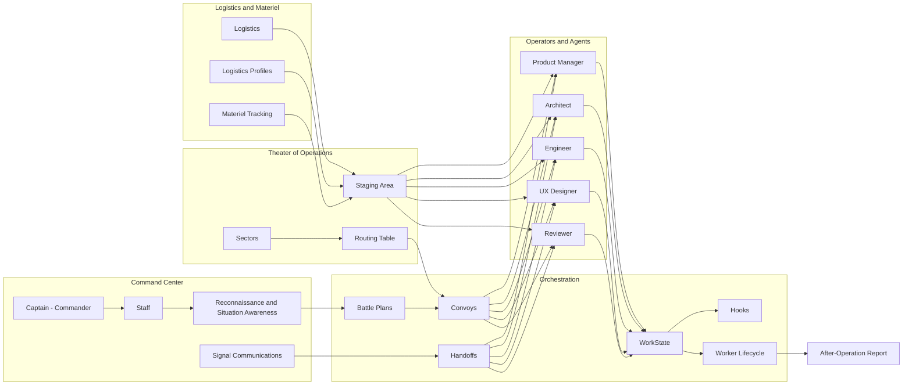

# Multi-Agent Runtime Backlog (Military-Themed)

## Mission Intent
Evolve AI-Squad into a multi-agent runtime with persistent coordination, lifecycle oversight, and cross-workspace operations while preserving existing CLI workflows.

## Operational Flow (Visual)

## Roles and Responsibilities (Table)
| Role | Responsibility | Primary Actions | Outputs |
| --- | --- | --- | --- |
| Captain (Commander) | Command and control, command hierarchy, directive control | Build battle plans, coordinate convoys, authorize escalation | Coordination plan, command guidance |
| Staff | Situation awareness and coordination | Reconnaissance index, routing decisions, mission dispatch | Mission plans, routing updates |
| Signal | Communications and coordination | Signal messaging, acknowledgements, nudges | Delivery logs, comms status |
| Product Manager | Requirements and PRD | Define requirements, create PRD, handoff | PRD, work items |
| Architect | System design and ADR | Design architecture, write ADR/spec | ADR/spec, design artifacts |
| Engineer | Implementation and tests | Implement features, write tests | Code, test results |
| UX Designer | User experience design | Wireframes, flows, prototypes | UX artifacts |
| Reviewer | Quality assurance | Review code, validate tests | Review report, approval status |
| WorkState | Persistent work tracking | Track work items, dependencies, status | Work state records |
| Hooks | Durable snapshots | Persist work item snapshots | Hook artifacts |
| Worker Lifecycle | Ephemeral run tracking | Track runs, detect stalls | Lifecycle events |
| Logistics | Materiel and provisioning | Staging area provisioning, logistics profiles, capacity tracking | Provisioned environments, utilization reports |

## Current Capability vs Build
| Area | Current | Build (Simple) |
| --- | --- | --- |
| Command and control | Captain coordination | Keep Captain, add staff-level routing rules |
| Battle plans | Battle plans exist | Keep battle plans as-is |
| Convoys / mission dispatch | Convoys exist | Add routing table input |
| Signal / communications | Signal exists | Add ack + retry (minimal) |
| WorkState + hooks | Exists | Keep as-is |
| Worker lifecycle | Exists | Add patrol checks for stale work |
| Theater of operations | Not present | Add theater/sector config registry |
| Staging area | Not present | Add staging area directories per sector |
| Reconnaissance / situation awareness | Partial status | Add recon index summary |
| After-operation report | Not present | Add simple report output |

## Simplified Backlog (Build Only What’s Missing)

### EPIC A — Theater and Routing (Simple)
- **Feature A1:** Theater + Sector registry (config only)
  - **User Story:** As Staff, I want a theater registry so I can coordinate missions across sectors.
  - **Acceptance Criteria:**
    - Theaters contain sectors with repo paths.
    - Routing table maps prefixes to sectors.
- **Feature A2:** Staging area directories
  - **User Story:** As Logistics, I want a staging area per sector so operators can deploy quickly.
  - **Acceptance Criteria:**
    - Staging areas created on init.

### EPIC B — Reconnaissance and Patrol (Simple)
- **Feature B1:** Reconnaissance index summary
  - **User Story:** As Staff, I want a recon summary so I can maintain situation awareness.
  - **Acceptance Criteria:**
    - Summary includes active work items, convoys, and signals.
- **Feature B2:** Patrolling for stale work
  - **User Story:** As the Sentinel, I want patrols that flag stalled work.
  - **Acceptance Criteria:**
    - Patrol detects stale items and logs escalation events.

### EPIC C — Reporting (Simple)
- **Feature C1:** After-operation report
  - **User Story:** As the Commander, I want an after-operation report to review outcomes.
  - **Acceptance Criteria:**
    - Report includes completed/failed counts and top errors.

---

## Verification: Military Terms Used (from the established list)
The following terms from the established military terms list were used for roles/actions: **command and control**, **command center**, **command hierarchy**, **staff**, **staging area**, **reconnaissance**, **patrolling**, **logistics**, **materiel**, **situation awareness**, **directive control**, **mission-type tactics**, and **operational level of war**.

Reference: https://en.wikipedia.org/wiki/List_of_established_military_terms
