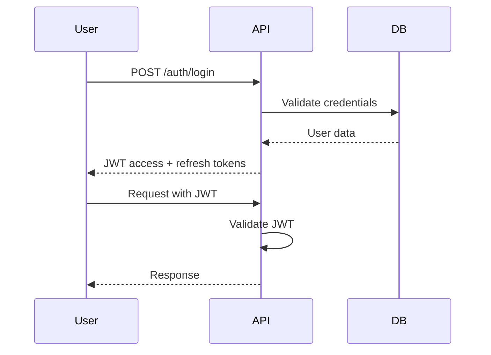
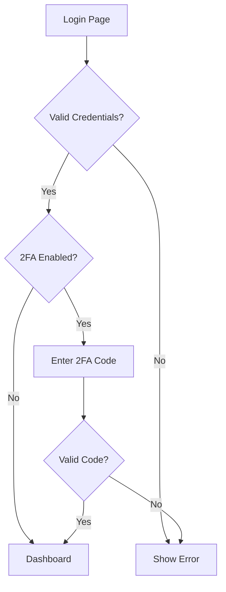

# Multi-Agent Collaboration Example

This example shows how multiple AI-Squad agents work together on complex tasks.

## Scenario: Epic Planning

**Epic:** Build user authentication system

### Step 1: Create Epic Issue

```bash
gh issue create \
  --title "[Epic] User Authentication System" \
  --label "type:epic" \
  --body "Implement complete user authentication with JWT, password reset, and 2FA"
```

**Issue #100 created**

### Step 2: Run Collaboration

```bash
squad collab 100 pm architect ux
```

This runs three agents in sequence:
1. **Product Manager** - Creates PRD and breaks down epic
2. **Architect** - Designs technical solution
3. **UX Designer** - Creates authentication flows and UI

**Output:**

```
Running Product Manager for issue #100...
✅ PRD created: docs/prd/PRD-100.md
✅ Created 3 feature issues: #101, #102, #103

Running Architect for issue #100...
✅ ADR created: docs/adr/ADR-100.md
✅ Spec created: docs/specs/SPEC-100.md

Running UX Designer for issue #100...
✅ UX design created: docs/ux/UX-100.md

✅ Collaboration complete!
```

### Generated Documents

#### PRD (Product Manager)

**`docs/prd/PRD-100.md`**

```markdown
# Product Requirements Document: User Authentication System

## User Stories

### Epic Story
As a user
I want secure authentication
So that my account is protected

### Feature Stories (Created as Issues)

#### #101: JWT Authentication
As a developer
I want JWT-based authentication
So that sessions are stateless

#### #102: Password Reset
As a user
I want to reset my password
So that I can regain access if forgotten

#### #103: Two-Factor Authentication
As a user
I want optional 2FA
So that my account has extra security

## Success Metrics
- Login success rate > 99.9%
- Password reset completion > 80%
- 2FA adoption > 30% within 3 months
```

#### ADR (Architect)

**`docs/adr/ADR-100.md`**

```markdown
# Architecture Decision Record: JWT Authentication

## Context
Need stateless authentication for scalability.

## Decision
Use JWT tokens with RS256 signing algorithm.

**Token Structure:**
- Access token: 15 minutes expiry
- Refresh token: 7 days expiry
- Stored in httpOnly cookies

**Architecture:**



## Consequences
✅ Stateless (scalable)
✅ Secure (signed tokens)
⚠️ Cannot revoke immediately (use short expiry)
```

#### UX Design (UX Designer)

**`docs/ux/UX-100.md`**

```markdown
# UX Design: User Authentication System

## User Flows

### Login Flow



### Wireframes

#### Login Screen

```
+----------------------------------------+
|                                        |
|           [App Logo]                   |
|                                        |
|  +----------------------------------+  |
|  | Email                            |  |
|  +----------------------------------+  |
|                                        |
|  +----------------------------------+  |
|  | Password                   [👁]  |  |
|  +----------------------------------+  |
|                                        |
|  [ ] Remember me   [Forgot password?]  |
|                                        |
|  +----------------------------------+  |
|  |           LOGIN                  |  |
|  +----------------------------------+  |
|                                        |
|  Don't have an account? [Sign up]     |
|                                        |
+----------------------------------------+
```

## Accessibility
- ✅ ARIA labels on all inputs
- ✅ Keyboard navigation
- ✅ Screen reader support
- ✅ High contrast mode
```

### Step 3: Implement Features

Now implement each feature issue:

```bash
# Feature #101: JWT Authentication
squad collab 101 architect engineer

# Feature #102: Password Reset
squad collab 102 architect engineer ux

# Feature #103: Two-Factor Authentication
squad collab 103 architect engineer ux
```

## Collaboration Patterns

### Pattern 1: Epic Planning

**Agents:** PM + Architect + UX  
**Use case:** Breaking down large features

```bash
squad collab <epic#> pm architect ux
```

### Pattern 2: Feature Development

**Agents:** Architect + Engineer + UX  
**Use case:** Implementing features

```bash
squad collab <feature#> architect engineer ux
```

### Pattern 3: Design Review

**Agents:** UX + Architect  
**Use case:** Validating designs before implementation

```bash
squad collab <design#> ux architect
```

### Pattern 4: Bug Investigation

**Agents:** Engineer  
**Use case:** Quick bug fixes

```bash
squad engineer <bug#>
```

### Pattern 5: Architecture Review

**Agents:** Architect + Reviewer  
**Use case:** Technical design validation

```bash
squad collab <tech-debt#> architect reviewer
```

## Benefits of Collaboration

1. **Consistency** - All agents follow same standards
2. **Completeness** - All aspects covered (requirements, design, UX)
3. **Efficiency** - Sequential execution saves time
4. **Traceability** - Clear documentation trail
5. **Quality** - Multiple perspectives on solution

## Tips

1. **Start with PM for epics** - Break down before designing
2. **Include UX for UI features** - Don't skip design phase
3. **Always include Engineer** - Someone needs to implement
4. **Use Reviewer for PRs** - Ensure quality standards
5. **Chain commands** - `squad collab X pm architect && squad collab Y engineer`

## Next Example

See [GitHub Actions integration](../github-actions/) for automated workflows.
